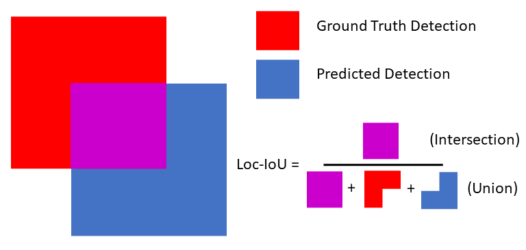
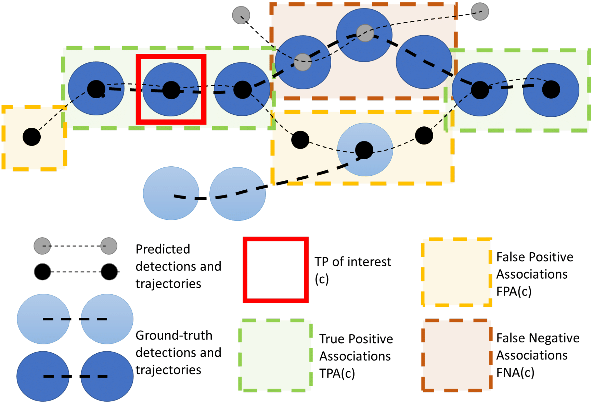

# Deep SORT

## Introduction
This repository contains code for *Simple Online and Realtime Tracking with a Deep Association Metric* (Deep SORT).
We extend the original [SORT](https://github.com/abewley/sort) algorithm to
integrate appearance information based on a deep appearance descriptor.
See the [arXiv preprint](https://arxiv.org/abs/1703.07402) for more information.


## Dependencies

The code is compatible with Python 2.7 and 3. The following dependencies are
needed to run the tracker:

* NumPy
* sklearn
* OpenCV

Additionally, feature generation requires TensorFlow (>= 1.0).

## Running

### 

The following example starts the tracker on one of the
[MOT16 benchmark](https://motchallenge.net/data/MOT16/)
sequences.
We assume resources have been extracted to the repository root directory and
the MOT16 benchmark data is in `./MOT16`:
```
python deep_sort_app.py \
    --sequence_dir=./MOT16/test/MOT16-06 \
    --detection_file=./resources/detections/MOT16_POI_test/MOT16-06.npy \
    --min_confidence=0.3 \
    --nn_budget=100
```
Check `python deep_sort_app.py -h` for an overview of available options.
There are also scripts in the repository to visualize results, generate videos,
and evaluate the MOT challenge benchmark.

## Generating detections

Beside the main tracking application, this repository contains a script to
generate features for person re-identification, suitable to compare the visual
appearance of pedestrian bounding boxes using cosine similarity.
The following example generates these features from standard MOT challenge
detections. Again, we assume resources have been extracted to the repository
root directory and MOT16 data is in `./MOT16`:
```
python tools/generate_detections.py \
    --model=resources/networks/mars-small128.pb \
    --mot_dir=./MOT16/train \
    --output_dir=./resources/detections/MOT16_train
```
The model has been generated with TensorFlow 1.5. If you run into
incompatibility, re-export the frozen inference graph to obtain a new
`mars-small128.pb` that is compatible with your version:
```
python tools/freeze_model.py
```
The ``generate_detections.py`` stores for each sequence of the MOT16 dataset
a separate binary file in NumPy native format. Each file contains an array of
shape `Nx138`, where N is the number of detections in the corresponding MOT
sequence. The first 10 columns of this array contain the raw MOT detection
copied over from the input file. The remaining 128 columns store the appearance
descriptor. The files generated by this command can be used as input for the
`deep_sort_app.py`.

**NOTE**: If ``python tools/generate_detections.py`` raises a TensorFlow error,
try passing an absolute path to the ``--model`` argument. This might help in
some cases.

## Training the model

To train the deep association metric model we used a novel [cosine metric learning](https://github.com/nwojke/cosine_metric_learning) approach which is provided as a separate repository.

## Overview of source files

In the top-level directory are executable scripts to execute, evaluate, and
visualize the tracker. The main entry point is in `deep_sort_app.py`.
This file runs the tracker on a MOTChallenge sequence.

In package `deep_sort` is the main tracking code:

* `detection.py`: Detection base class.
* `kalman_filter.py`: A Kalman filter implementation and concrete
   parametrization for image space filtering.
* `linear_assignment.py`: This module contains code for min cost matching and
   the matching cascade.
* `iou_matching.py`: This module contains the IOU matching metric.
* `nn_matching.py`: A module for a nearest neighbor matching metric.
* `track.py`: The track class contains single-target track data such as Kalman
  state, number of hits, misses, hit streak, associated feature vectors, etc.
* `tracker.py`: This is the multi-target tracker class.

The `deep_sort_app.py` expects detections in a custom format, stored in .npy
files. These can be computed from MOTChallenge detections using
`generate_detections.py`. We also provide
[pre-generated detections](https://drive.google.com/open?id=1VVqtL0klSUvLnmBKS89il1EKC3IxUBVK).

### Detection logic

Detect

#### Nanodet

[NanodetDetectionsProvider](src/deep_sort/detector/nanodet_detections_provider.py) is using [Nanodet](https://github.com/RangiLyu/nanodet) model.

The library should be installed and available in order to run this code. To do so you need

1. Clone the repository
2. Setup the library calling `python setup.py develop` in the root of the project

The library does not work on MacOS. In order to make it work you need to patch some files in the original code.
Here is the patch that you can apply on your code

```
diff --git a/nanodet/model/arch/one_stage_detector.py b/nanodet/model/arch/one_stage_detector.py
index 6b0a098..e791d9f 100644
--- a/nanodet/model/arch/one_stage_detector.py
+++ b/nanodet/model/arch/one_stage_detector.py
@@ -47,14 +47,14 @@ class OneStageDetector(nn.Module):
 
     def inference(self, meta):
         with torch.no_grad():
-            torch.cuda.synchronize()
+            # torch.cuda.synchronize()
             time1 = time.time()
             preds = self(meta["img"])
-            torch.cuda.synchronize()
+            # torch.cuda.synchronize()
             time2 = time.time()
             print("forward time: {:.3f}s".format((time2 - time1)), end=" | ")
             results = self.head.post_process(preds, meta)
-            torch.cuda.synchronize()
+            # torch.cuda.synchronize()
             print("decode time: {:.3f}s".format((time.time() - time2)), end=" | ")
         return results
```

## Metric

### HOTA

Metric used in this project is called _Higher Order Tracking Accuracy_ (aka HOTA).

The metric consists of a few sub metrics:

#### 1. Localization

Finds the spatial alignment between predicted detections and ground truth detections.
[_IOU_](https://en.wikipedia.org/wiki/Jaccard_index) is used to find localisation between **one** detection and **one**
ground truth object.



Overall Localization Accuracy (LocA) is calculated over all pairs across the **entire dataset**.

```math
LocA = \frac{1}{|TP|} \sum_{c \in TP} Loc-IOU(c)
```

In the codebase iou implemented in [iou utils](./src/utils/geometry/iou_utils.py) and [Rect](./src/utils/geometry/rect.py)

#### 2. Detection

Detection measures the alignment between all predicted detections and ground truth detections.
We rely on _localisation_ results to find the overlap between predictions and ground truth. To break the tie
when there are more than one prediction intersect with a ground truth _Hungarian algorithm_ (aka assignment problem algorithm) is used.

Implementation of the assignment algorithm is used from [scipy.linear_sum_assignment](https://docs.scipy.org/doc/scipy/reference/generated/scipy.optimize.linear_sum_assignment.html#scipy-optimize-linear-sum-assignment),
in the latest release of the library _Hungarian algorithm_ has been replaced with _Jonker-Volgenant algorithm_.

After running the algorithm we end up with matched and unmatched elements. We can divide them into 3 groups:
True Positives (intersection between the two sets of detections), False Positives (predicted detections that don’t match),
and False Negatives (ground-truth detections that don’t match).

Overall Detection Accuracy (aka DetA) is calcuated by using the count of TPs, FNs and FPs over the whole dataset.

```math
DetA=\frac{|TP|}{|TP|+|FP|+|FN|}
```

#### 3. Association

Show how well the tracking links detections **over time** into the **same identities**.

The intersection between two tracks can be found in a similar way as during the detection step, but with
a little difference: True Positive Associations (number of True Positive matches between the two tracks), 
False Positive Associations (any remaining detections in the predicted track which are either matched to other ground-truth tracks or none at all),
and False Negative Associations (any remaining detections in the ground-truth track).

See visual example of the definitions TPA, FNA and FPA:



Overall Association Accuracy (aka AssA) is calculated for **every** True Positive pair **across the entire dataset**.

```math
AssA=\frac{1}{|TP|} \sum_{c \in TP} \frac{|TPA(c)|}{|TPA(c)|+|FPA(c)|+|FNA(c)|}
```

#### Gathering sub-metrics together

Detection and association were defined using a _Hungarian matching_ based on a certain _Loc-IoU threshold_ (_α_). 
Since they both depend on the quality of localisation we calculate them over a range of different _α_ thresholds.

_HOTA_ for specific alpha a can be calculated as:

```math
HOTA_{\alpha}=\sqrt{DetA_{\alpha}*AssA_{\alpha}}
```

Overall _HOTA_ is a **discrete integral** over different alphas:

```math
HOTA=\int_{0 < \alpha \le 1} HOTA_{\alpha} \thickapprox \sum_{\alpha=0.05,\space \alpha += 0.05}^{0.95} HOTA_{\alpha}
```

#### Implementation

- [HotaMetric](./src/metrics/hota_metric.py)


#### References

- [How to evaluate tracking with the HOTA metricsPermalink](https://autonomousvision.github.io/hota-metrics/)
- [HOTA: A Higher Order Metric for Evaluating Multi-object Tracking](https://link.springer.com/article/10.1007/s11263-020-01375-2)
- [TrackEval](https://github.com/JonathonLuiten/TrackEval/blob/master/trackeval/metrics/hota.py)

## Acknowledgement

Project is based on a [DeepSort algorithm implementation](https://github.com/nwojke/deep_sort) originally proposed in ["Simple Online and Realtime Tracking with a Deep Association Metric"](https://arxiv.org/abs/1703.07402).
The original project is licensed under Gnu General Public License.
