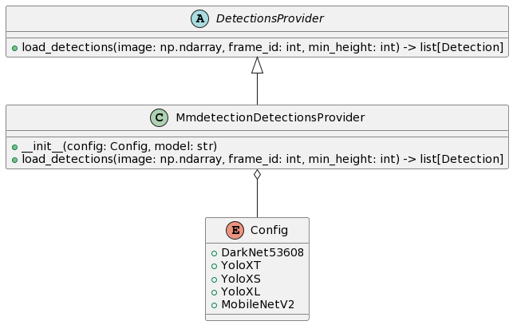

# Deep SORT

## Introduction

This repository contains code for *Simple Online and Realtime Tracking with a Deep Association Metric* (Deep SORT).

It extends [the original DeepSORT](https://github.com/nwojke/deep_sort) algorithm to integrate
improved detections and Deep REID mechanisms.

## Data

The project uses [Multiple Object Tracking Benchmark](https://motchallenge.net/) for evaluation.

The project is using the following videos:
- KITTI-17
- MOT16-09
- MOT16-11
- PETS09-S2L1
- TUD-Campus
- TUD-Stadtmitte

MOT is published under [ Creative Commons Attribution-NonCommercial-ShareAlike 3.0 License](https://creativecommons.org/licenses/by-nc-sa/3.0/).

| MOT16-11                                   | MOT16-06                                   | MOT16-13                                   | MOT16-01                                   | MOT16-14                                   |
|--------------------------------------------|--------------------------------------------|--------------------------------------------|--------------------------------------------|--------------------------------------------|
|  |  |  |  |  |

## Dependencies

The code is compatible with Python 3.9+. 
The following dependencies are needed to run the tracker:

* NumPy
* sklearn
* OpenCV
* TensorFlow
* Pandas
* Torchvision

The full list of requirements can be found in [requirements.txt](./requirements.txt).
Moreover, the project depends on other projects via [git sumbodules system](https://git-scm.com/book/en/v2/Git-Tools-Submodules).
You can find all declared submodules in [.gitmodules](./.gitmodules) or under [the dependencies folder](./dependencies).

## Running

### Setup

First of all, it is necessary to **install** the project.

To do so just run the following commands:

```bash
pip install -r requirements.txt
python setup.py develop
```

We are good to go and run the project! Yay 🎉

### Commands

There are 2 modes to run the app:
- **Ground truth visualisation** that does not start the tracker but visualise ground truth from `gt` folder
- **Tracker** runs the algorithm and this is _the main part of the project_

This is an example of how to run `ground truth visualisation`.

```bash
deep-sort ground-truth ./data/sequences/MOT16-11
```

You will see something similar to the image below:


The following example runs the tracker:

```bash
deep-sort run ./data/sequences -e HOTA DetA AssA F1 Precision Recall 
```

In this case you will see something similar to the next image:


Check `deep-sort -h` for an overview of available options.

## Overview of source files

### Detection


Detections logic is located in [the detector folder](./src/deep_sort/detector) under **deep_sort**.
There are 2 central abstractions in the project: _Detection_ and _DetectionsProvider_.

_DetectionsProvider_ helps to abstract a specific detections logic under a unified interface.
Every provider should return _a lift of Detections_ in a given sequence frame.
A frame is described by the image matrix (np.ndarray) and a frame id.
The provided list of detections helps to identify an origin of every detection,
i.e. where the particular detection is located in the frame, and a confidence score.

There are a few classes implementing __DetectionsProvider__.

_Please, do note, `--n_init 0` will be used during detections evaluation to initialise tracks as soon as possible._

#### FileDetectionsProvider [from original DeepSORT algorithm]


_FileDetectionsProvider_ is the logic that **was used in the original DeepSORT** version of the project.
It reads the `det/det.txt` file and extract detections from it.

Command to run the sequence in the given configuration is:

```bash
deep-sort run ./data/sequences -e F1 Precision Recall --n_init 0
```

During the evaluation there is a noticeable amount of mis-detections.


**Final score**

```text
                    |F1        |Precision |Recall    |
KITTI-17            |   0.72068|    0.8506|   0.62518|
MOT16-09            |   0.54102|   0.93847|   0.38006|
MOT16-11            |   0.60966|   0.98326|   0.44179|
PETS09-S2L1         |    0.7887|   0.70876|   0.88896|
TUD-Campus          |   0.72296|   0.77215|   0.67967|
TUD-Stadtmitte      |   0.72562|   0.72719|   0.72405|
COMBINED            |   0.68477|   0.83007|   0.62329|
```

#### YoloV5DetectionsProvider


This _DetectionsProvider_ implements [Yolo V5](https://github.com/ultralytics/yolov5) object detection model.

This project implements `YoloV5` as a submodule.

Detector supports models:
- Nano, aka [YOLOv5n](https://github.com/ultralytics/yolov5/releases/download/v7.0/yolov5n.pt)
- Small, aka [YOLOv5s](https://github.com/ultralytics/yolov5/releases/download/v7.0/yolov5s.pt)
- Medium, aka [YOLOv5m](https://github.com/ultralytics/yolov5/releases/download/v7.0/yolov5m.pt)
- Large, aka [YOLOv5l](https://github.com/ultralytics/yolov5/releases/download/v7.0/yolov5l.pt)
- Nano6, aka [YOLOv5n6](https://github.com/ultralytics/yolov5/releases/download/v7.0/yolov5n6.pt)

All models are available in [`data/yolov5_binaries`](./dependencies/yolov5_binaries). However, if you were not able
to locate some checkpoints, please, do check the links above or the YoloV5 official repository.

**YoloV5N**

Command to run the sequence in the given configuration is:

```bash
deep-sort run ./data/sequences -e F1 Precision Recall -d yolov5n --n_init 0
```

A lot of people were not recognized correctly.


FPS score has also dropped dramatically across the whole dataset (almost twice). Though, please, approach this and
any further notices about FPS drops with a reasonable pragmatism: **the local setup which is used for this project
is CPU-bounded as does not support CUDA**.

**Final scores**

```text
                    |F1        |Precision |Recall    |
KITTI-17            |   0.34803|   0.83799|   0.21962|
MOT16-09            |   0.35138|   0.96578|   0.21476|
MOT16-11            |    0.4939|   0.97401|   0.33083|
PETS09-S2L1         |   0.61212|   0.94028|   0.45375|
TUD-Campus          |   0.57418|   0.93125|   0.41504|
TUD-Stadtmitte      |   0.66321|   0.99139|   0.49827|
COMBINED            |   0.50714|   0.94012|   0.35538|
```

**YoloV5N6**

Command to run the sequence in the given configuration is:

```bash
deep-sort run ./data/sequences -e F1 Precision Recall -d yolov5n6 --n_init 0
```

Seems like this implementation provides more detections.


Performs really badly on [`KITTI17`](./data/sequences/KITTI-17)


**Final scores**

```text
                    |F1        |Precision |Recall    |
KITTI-17            |   0.38761|   0.89418|   0.24744|
MOT16-09            |   0.34508|   0.97522|   0.20963|
MOT16-11            |   0.48004|   0.96793|   0.31916|
PETS09-S2L1         |   0.51717|   0.94104|   0.35657|
TUD-Campus          |   0.69272|   0.95588|   0.54318|
TUD-Stadtmitte      |   0.71792|    0.9954|   0.56142|
COMBINED            |   0.52342|   0.95494|    0.3729|
```

**YoloV5S**

Command to run the sequence in the given configuration is:

```bash
deep-sort run ./data/sequences -e F1 Precision Recall -d yolov5s --n_init 0
```

Much more accurate than `nano` models.


**Final scores**

```text
                    |F1        |Precision |Recall    |
KITTI-17            |   0.56972|   0.89097|   0.41874|
MOT16-09            |   0.48913|   0.96685|   0.32737|
MOT16-11            |   0.58584|   0.96238|   0.42108|
PETS09-S2L1         |   0.82626|   0.93609|    0.7395|
TUD-Campus          |    0.6831|   0.92823|   0.54039|
TUD-Stadtmitte      |   0.81384|   0.98765|   0.69204|
COMBINED            |   0.66131|   0.94536|   0.52319|
```

**YoloV5M**

Command to run the sequence in the given configuration is:

```bash
deep-sort run ./data/sequences -e F1 Precision Recall -d yolov5m --n_init 0
```

Good quality of detections.


Moreover, on **CPU-bounded** devices there are about ~4-5 FPS,
which should be better on devices with available GPU and CUDA processing.

**Final scores**

```text
                    |F1        |Precision |Recall    |
KITTI-17            |   0.63188|   0.89757|   0.48755|
MOT16-09            |   0.58421|   0.95429|   0.42096|
MOT16-11            |   0.65607|   0.95539|   0.49956|
PETS09-S2L1         |   0.87007|   0.92026|   0.82507|
TUD-Campus          |   0.75042|   0.94118|   0.62396|
TUD-Stadtmitte      |   0.84325|   0.98837|   0.73529|
COMBINED            |   0.72265|   0.94284|   0.59873|
```

❗️ It seems that this model _outperforms_ the original algorithm by **all metrics**.

**YoloV5L**

Command to run the sequence in the given configuration is:

```bash
deep-sort run ./data/sequences -e F1 Precision Recall -d yolov5l --n_init 0
```

Outperforms all other `YOLO` models. However, not applicable in runtime
**at least on CPU-bounded** devices. Yet, some techniques as resizing or
buffering can help to improve performance if this model is required for usage.


**Final scores**

```text
                    |F1        |Precision |Recall    |
KITTI-17            |    0.6747|   0.91919|   0.53294|
MOT16-09            |   0.64809|   0.94463|   0.49325|
MOT16-11            |   0.68928|   0.95127|   0.54044|
PETS09-S2L1         |   0.88497|    0.9073|   0.86372|
TUD-Campus          |   0.75208|   0.93388|   0.62953|
TUD-Stadtmitte      |   0.85617|   0.98101|   0.75952|
COMBINED            |   0.75088|   0.93955|   0.63657|
```

#### NanodetDetectionsProvider


[NanodetDetectionsProvider](src/deep_sort/detector/nanodet_detections_provider.py)
is using [Nanodet](https://github.com/RangiLyu/nanodet) model.

⚠️⚠️⚠️ Unfortunately, this library does not work on MacOS, therefore `Nanodet` used in this project is a _patched_ version.

This is the patch that was sent to the authors of `Nanodet`:
- [#516 Guard CUDA calls with an explicit check](https://github.com/RangiLyu/nanodet/pull/516)

_NanodetDetectionsProvider_ supports the following checkpoints:
- Legacy M
- PlusM320
- PlusM15X320
- PlusM416
- PlusM15X416 

**Legacy M**

Command to run the sequence in the given configuration is:

```bash
deep-sort run ./data/sequences -e F1 Precision Recall -d nanodet_legacy --n_init 0
```

Runs bad on: `PETS09-S2L1` and `MOT16-11` almost not detecting anything


**Final scores**

```text
                    |F1        |Precision |Recall    |
KITTI-17            |       0.0|       1.0|       0.0|
MOT16-09            |  0.047177|       1.0|  0.024158|
MOT16-11            |  0.021341|   0.95192|  0.010791|
PETS09-S2L1         |  0.025127|   0.93443|  0.012735|
TUD-Campus          |     0.205|       1.0|   0.11421|
TUD-Stadtmitte      |  0.055509|       1.0|  0.028547|
COMBINED            |  0.059026|   0.98106|   0.03174|
```

**PlusM320**

Command to run the sequence in the given configuration is:

```bash
deep-sort run ./data/sequences -e F1 Precision Recall -d nanodet_plusm320 --n_init 0
```

Still runs terrible on `PETS09-S2L1`


**Final scores**

```text
                    |F1        |Precision |Recall    |
KITTI-17            |       0.0|       1.0|       0.0|
MOT16-09            |   0.03329|   0.98889|   0.01693|
MOT16-11            |  0.076786|   0.95325|  0.040004|
PETS09-S2L1         | 0.0013396|       1.0|0.00067024|
TUD-Campus          |   0.19598|       1.0|   0.10864|
TUD-Stadtmitte      |    0.1563|       1.0|  0.084775|
COMBINED            |  0.077283|   0.99036|  0.041836|
```

**PlusM1.5X320**

Command to run the sequence in the given configuration is:

```bash
deep-sort run ./data/sequences -e F1 Precision Recall -d nanodet_plusm15x320 --n_init 0
```

Performs better `PETS09-S2L1` but still far away from idea. Perhaps,
the objects in the frame are too small for this model.


**Final scores**

```text
                    |F1        |Precision |Recall    |
KITTI-17            | 0.0029197|       0.5| 0.0014641|
MOT16-09            |  0.062581|   0.96591|  0.032338|
MOT16-11            |    0.1272|   0.93572|  0.068236|
PETS09-S2L1         | 0.0080107|       1.0| 0.0040214|
TUD-Campus          |   0.30189|   0.98462|   0.17827|
TUD-Stadtmitte      |   0.11111|       1.0|  0.058824|
COMBINED            |   0.10228|   0.89771|  0.057193|
```

**PlusM416**

Command to run the sequence in the given configuration is:

```bash
deep-sort run ./data/sequences -e F1 Precision Recall -d nanodet_plusm416 --n_init 0
```

Cannot detect small objects

| Small objects                                                               | Big objects                                                                |
|-----------------------------------------------------------------------------|----------------------------------------------------------------------------|
|  |  |

**Final scores**

```text
                    |F1        |Precision |Recall    |
KITTI-17            |       0.0|       1.0|       0.0|
MOT16-09            |  0.082771|   0.99561|  0.043181|
MOT16-11            |   0.15543|   0.92951|  0.084805|
PETS09-S2L1         | 0.0071238|       1.0| 0.0035746|
TUD-Campus          |   0.26087|   0.98182|   0.15042|
TUD-Stadtmitte      |    0.2445|       1.0|   0.13927|
COMBINED            |   0.12511|   0.98449|  0.070209|
```

**PlusM1.5X416**

Command to run the sequence in the given configuration is:

```bash
deep-sort run ./data/sequences -e F1 Precision Recall -d nanodet_plusm15x416 --n_init 0
```

The best performance across all `nanodets`. However, the final quality is
still not enough. Though it is worth mentioning that frame rate is much
better than using `Yolo`.


**Final scores**

```text
                    |F1        |Precision |Recall    |
KITTI-17            | 0.0058394|       1.0| 0.0029283|
MOT16-09            |   0.10261|   0.95638|  0.054213|
MOT16-11            |   0.21776|   0.95752|   0.12285|
PETS09-S2L1         |  0.015954|   0.97297| 0.0080429|
TUD-Campus          |   0.31308|   0.97101|   0.18663|
TUD-Stadtmitte      |   0.36723|       1.0|   0.22491|
COMBINED            |   0.17041|   0.97631|  0.099929|
```

#### MMDetectionDetectionsProvider



_MMDetectionDetectionsProvider_ uses [MMDetection](https://github.com/open-mmlab/mmdetection) toolbox.

Supported models:
- [YoloXT](https://github.com/open-mmlab/mmdetection/blob/main/configs/yolox/README.md)
- [YoloXS](https://github.com/open-mmlab/mmdetection/blob/main/configs/yolox/README.md)
- [YoloXL](https://github.com/open-mmlab/mmdetection/blob/main/configs/yolox/README.md)
- [MobileNetV2](https://github.com/open-mmlab/mmdetection/blob/main/configs/yolo/README.md)
- [DarkNet53608](https://github.com/open-mmlab/mmdetection/blob/main/configs/yolo/README.md)


⚠️ Please, do keep in mind that due to the large size of weights/checkpoints they won't be provided with this repo.
Do download them from the `MMDetection` repository.

⚠️⚠️ Use `--extra` flag to pass path to the model weights.

**DarkNet-53**

Command to run the sequence in the given configuration is:

```bash
deep-sort run ./data/sequences -e F1 Precision Recall -d mmdet_darknet --n_init 0 --extra path_to_darknet_model
```

Detections quality is amazing but performance has some space for improvements.


**Final scores**

```text
                    |F1        |Precision |Recall    |
KITTI-17            |   0.72853|    0.7649|   0.69546|
MOT16-09            |   0.69262|   0.92555|   0.55336|
MOT16-11            |   0.67816|    0.9424|   0.52965|
PETS09-S2L1         |   0.84404|    0.8882|   0.80407|
TUD-Campus          |   0.76066|    0.9243|   0.64624|
TUD-Stadtmitte      |   0.82335|   0.99631|   0.70156|
COMBINED            |   0.75456|   0.90694|   0.65506|
```

**MobileNet V2**

Command to run the sequence in the given configuration is:

```bash
deep-sort run ./data/sequences -e F1 Precision Recall -d mmdet_mobilenetv2 --n_init 0 --extra path_to_mobilenet_model
```


**Final scores**

```text
                    |F1        |Precision |Recall    |
KITTI-17            |   0.61736|   0.94562|   0.45827|
MOT16-09            |   0.49639|   0.97225|   0.33327|
MOT16-11            |   0.50458|   0.95879|   0.34238|
PETS09-S2L1         |   0.67898|   0.87549|   0.55451|
TUD-Campus          |   0.60232|   0.98113|   0.43454|
TUD-Stadtmitte      |   0.62722|   0.99251|   0.45848|
COMBINED            |   0.58781|    0.9543|   0.43024|
```


**YoloXT**

Command to run the sequence in the given configuration is:

```bash
deep-sort run ./data/sequences -e F1 Precision Recall -d mmdet_yoloxt --n_init 0 --extra path_to_yolox_model
```

Super impressive for a `tiny` model as it performs better than the original algorithm.


**Final scores**

```text
                    |F1        |Precision |Recall    |
KITTI-17            |   0.56888|   0.88037|    0.4202|
MOT16-09            |   0.53987|   0.96521|   0.37474|
MOT16-11            |   0.62991|    0.9569|   0.46948|
PETS09-S2L1         |   0.85424|   0.93142|   0.78887|
TUD-Campus          |   0.74333|   0.92531|   0.62117|
TUD-Stadtmitte      |   0.85867|   0.98326|   0.76211|
COMBINED            |   0.69915|   0.94041|   0.57276|
```

**YoloXS**

Command to run the sequence in the given configuration is:

```bash
deep-sort run ./data/sequences -e F1 Precision Recall -d mmdet_yoloxs --n_init 0 --extra path_to_yolox_model
```

Performance is a bit worse but still _tolerable_ on the **CPU-bounded** devices. 


**Final scores**

```text
                    |F1        |Precision |Recall    |
KITTI-17            |   0.75043|   0.91932|   0.63397|
MOT16-09            |   0.67437|   0.97275|   0.51607|
MOT16-11            |    0.6938|   0.96175|   0.54262|
PETS09-S2L1         |   0.88307|   0.89234|   0.87399|
TUD-Campus          |   0.79808|   0.93962|   0.69359|
TUD-Stadtmitte      |   0.87458|   0.98378|    0.7872|
COMBINED            |   0.77905|   0.94493|   0.67457|
```

**YoloXL**

Command to run the sequence in the given configuration is:

```bash
deep-sort run ./data/sequences -e F1 Precision Recall -d mmdet_yoloxl --n_init 0 --extra path_to_yolox_model
```


**Final scores**

```text
                    |F1        |Precision |Recall    |
KITTI-17            |    0.8263|   0.92714|   0.74524|
MOT16-09            |   0.77234|   0.95103|   0.65018|
MOT16-11            |    0.7321|   0.93389|   0.60203|
PETS09-S2L1         |   0.89697|   0.88497|   0.90929|
TUD-Campus          |   0.85542|   0.93115|   0.79109|
TUD-Stadtmitte      |   0.87992|   0.97476|    0.8019|
COMBINED            |   0.82718|   0.93382|   0.74996|
```

#### YoloV8DetectionsProvider


_YoloV8DetectionsProvider_ uses [YoloV8](https://github.com/ultralytics/ultralytics) model.

Model supports the following checkpoints:
- nano
- small
- medium
- large

⚠️ YoloV8 downloads models automatically.

**YoloV8N**

Command to run the sequence in the given configuration is:

```bash
deep-sort run ./data/sequences -e F1 Precision Recall -d yolov8n --n_init 0
```

Good performance, runs about ~90-100% of the original speed, i.e. 10% FPS drop only.


**Final scores**

```text
                    |F1        |Precision |Recall    |
KITTI-17            |    0.4572|   0.87917|   0.30893|
MOT16-09            |   0.45476|   0.95668|   0.29827|
MOT16-11            |    0.5959|    0.9555|   0.43296|
PETS09-S2L1         |   0.69073|   0.93003|   0.54937|
TUD-Campus          |   0.66906|   0.94416|   0.51811|
TUD-Stadtmitte      |    0.7862|   0.99339|   0.65052|
COMBINED            |   0.60898|   0.94316|   0.45969|
```

Metrics are impressive for `nano` model.

**YoloV8S**

Command to run the sequence in the given configuration is:

```bash
deep-sort run ./data/sequences -e F1 Precision Recall -d yolov8s --n_init 0
```


A lot of detections for a small model as well.


**Final scores**

```text
                    |F1        |Precision |Recall    |
KITTI-17            |    0.5957|   0.89443|   0.44656|
MOT16-09            |   0.55655|   0.95773|   0.39224|
MOT16-11            |   0.65238|    0.9521|   0.49618|
PETS09-S2L1         |   0.75676|   0.93789|   0.63427|
TUD-Campus          |   0.73129|   0.93886|   0.59889|
TUD-Stadtmitte      |   0.82033|   0.98075|   0.70502|
COMBINED            |    0.6855|   0.94363|   0.54553|
```

❗️ This model **outperforms** the original detections algorithm.
Perhaps, bigger models as `medium`, `large` or `extra large` definitely works better than the original model.

**YoloV8M**

Command to run the sequence in the given configuration is:

```bash
deep-sort run ./data/sequences -e F1 Precision Recall -d yolov8m --n_init 0
```

The performance is a bit off, at least on **CPU-bounded** devices. Though, it seems
it should be just fine on GPU ones.


**Final scores**

```text
                    |F1        |Precision |Recall    |
KITTI-17            |   0.71159|   0.92093|    0.5798|
MOT16-09            |    0.6543|   0.95852|   0.49667|
MOT16-11            |   0.68223|   0.94571|   0.53357|
PETS09-S2L1         |   0.86067|   0.92793|    0.8025|
TUD-Campus          |    0.7743|   0.94758|    0.6546|
TUD-Stadtmitte      |   0.83913|   0.98485|   0.73097|
COMBINED            |    0.7537|   0.94759|   0.63302|
```

**YoloV8L**

Command to run the sequence in the given configuration is:

```bash
deep-sort run ./data/sequences -e F1 Precision Recall -d yolov8m --n_init 0
```

It seems real-time performance would not be amazing even on GPU ones.


**Final scores**

```text
                    |F1        |Precision |Recall    |
KITTI-17            |   0.73033|   0.92188|   0.60469|
MOT16-09            |   0.68475|   0.95729|     0.533|
MOT16-11            |    0.6989|   0.94912|   0.55308|
PETS09-S2L1         |   0.87608|    0.9032|   0.85054|
TUD-Campus          |   0.79808|   0.93962|   0.69359|
TUD-Stadtmitte      |    0.8595|   0.98113|   0.76471|
COMBINED            |   0.77461|   0.94204|    0.6666|
```

#### HogDetectionsProvider


_HogDetectionsProvider_ uses [HOGDescriptor](https://docs.opencv.org/4.x/d5/d33/structcv_1_1HOGDescriptor.html) and
[detectMultiScale](https://docs.opencv.org/4.8.0/d1/de5/classcv_1_1CascadeClassifier.html#aaf8181cb63968136476ec4204ffca498)
from [OpenCV](https://opencv.org/).

This provider was made to check whether "classic" algorithm can offer comparable results. Spoiler:
it is working not that bad as you may expect. Actually, quite surprising for a classical algorithm.

```bash
deep-sort run ./data/sequences -e F1 Precision Recall -d hog --n_init 0
```


**Final scores**

```text
                    |F1        |Precision |Recall    |
KITTI-17            |       0.0|       1.0|       0.0|
MOT16-09            |  0.083475|   0.39967|  0.046605|
MOT16-11            |  0.028998|   0.33656|  0.015152|
PETS09-S2L1         |       0.0|       1.0|       0.0|
TUD-Campus          |  0.026316|    0.2381|  0.013928|
TUD-Stadtmitte      | 0.0014378| 0.0042553|0.00086505|
COMBINED            |  0.023371|   0.49643|  0.012758|
```

#### GroundTruthDetectionsProvider


_GroundTruthDetectionsProvider_ returns ground truth as detections. It helps to check tracking metrics,
and should result 1.0 for detections evaluation.

⚠️ Though we are evaluating detections, **tracking** is still running and slightly affect
the final score as detections appears not immediately. 
It takes a little time (i.e. a few frames) from tracks to initialise.

```bash
deep-sort run ./data/sequences -e F1 Precision Recall -d gt --n_init 0
```

**Final scores**

```text
                    |F1        |Precision |Recall    |
KITTI-17            |   0.98827|   0.98972|   0.98682|
MOT16-09            |   0.99581|   0.99676|   0.99486|
MOT16-11            |    0.9934|   0.99432|   0.99248|
PETS09-S2L1         |    0.9962|   0.99687|   0.99553|
TUD-Campus          |   0.98319|   0.98873|   0.97772|
TUD-Stadtmitte      |    0.9883|   0.99044|   0.98616|
COMBINED            |   0.99086|   0.99281|   0.98893|
```

### REID

#### Features extraction


Features extractor is the main abstraction for converting a detection area into a feature vector.

The API of the class looks like:

| Method                                                          | Description                                                                                                                                 |
|-----------------------------------------------------------------|---------------------------------------------------------------------------------------------------------------------------------------------|
| **extract(image: np.ndarray, boxes: list[Rect]) -> np.ndarray** | it accepts original image and found detections, and returns a list of features vectors. Feature vectors go in the same order as detections. |

#### Tensorflow V1 [from original DeepSORT work]


[TensorflowV1FeaturesExtractor](./src/deep_sort/features_extractor/tensorflow_v1_features_extractor.py) provides
a tensorflow model to extract feature vectors from detections.

Command to run the sequence in the given configuration is:

```bash
deep-sort run ./data/sequences -e HOTA DetA AssA -d gt
```


**Scores**

```text
                    |HOTA      |DetA      |AssA      |
KITTI-17            |   0.71602|   0.78332|     0.655|
MOT16-09            |   0.83054|   0.91735|   0.75269|
MOT16-11            |   0.90087|   0.90305|   0.90062|
PETS09-S2L1         |   0.78951|   0.85509|   0.73012|
TUD-Campus          |   0.81401|   0.80881|   0.81978|
TUD-Stadtmitte      |   0.87434|   0.89017|   0.86596|
COMBINED            |   0.82088|   0.85963|   0.78736|
```

### Misc

#### Geometry, Rect


Rect represents a rectangular area and helps to deal with their geometry. It provides a few helpful methods:

| Method                                                                  | Description                                                                                                                                                    |
|-------------------------------------------------------------------------|----------------------------------------------------------------------------------------------------------------------------------------------------------------|
| **width: float**                                                        | returns width of the rect                                                                                                                                      |
| **height: float**                                                       | returns height of the rect                                                                                                                                     |
| **top: float**                                                          | returns first horizontal pixels position (aka top edge) in the original image                                                                                  |
| **left: float**                                                         | returns first vertical pixels position (aka left edge) in the original image                                                                                   |
| **right: float**                                                        | returns last vertical pixels position (aka right edge) in the original image                                                                                   |
| **bottom: float**                                                       | returns last horizontal pixels position (aka bottom edge) in the original image                                                                                |
| **center_x: float**                                                     | returns horizontal central position                                                                                                                            |
| **center_y: float**                                                     | returns vertical central position                                                                                                                              |
| **aspect_ratio: float**                                                 | returns ratio of width to height, i.e. `width / height`                                                                                                        |
| **area: float**                                                         | returns rectangle area, i.e. `width * height`                                                                                                                  |
| **inset(left: float, top: float, right: float, bottom: float) -> Rect** | adds paddings to the current rect and returns a new rect with new paddings                                                                                     |
| **check_if_intersects(that: Rect) -> bool**                             | checks if 2 rectangles are intersecting                                                                                                                        | 
| **iou(hat: Rect) -> float**                                             | calculates intersection over union, the return value is always within **[0, 1]**                                                                               |
| **resize(target_width: float, target_height: float) -> Rect**           | scales current rect and returns a new one with the same aspect ratio as target_width over target_height                                                        |
| **clip(that: Rect) -> Rect**                                            | clips the other rect by the bounding boxes of the current rect or raises exception if the other box is completely outside the bounding box of the current rect |

Rect fixes an issue within the original [`deep sort`](https://github.com/nwojke/deep_sort). Bottom right corners of
the bounding boxes are calculated incorrectly which _may affect detection and metrics calculation quality_.

This is the Pull Request that fixes the issue:
- [#314 Fix bbox bottom right corner calculation](https://github.com/nwojke/deep_sort/pull/314)


## Metric

### HOTA

Metric used in this project is called _Higher Order Tracking Accuracy_ (aka HOTA).

The metric consists of a few sub metrics:

#### 1. Localization

Finds the spatial alignment between predicted detections and ground truth detections.
[_IOU_](https://en.wikipedia.org/wiki/Jaccard_index) is used to find localisation between **one** detection and **one**
ground truth object.


Overall Localization Accuracy (LocA) is calculated over all pairs across the **entire dataset**.

```math
LocA = \frac{1}{|TP|} \sum_{c \in TP} Loc-IOU(c)
```

In the codebase iou implemented in [iou utils](./src/utils/geometry/iou_utils.py) and [Rect](./src/utils/geometry/rect.py)

#### 2. Detection

Detection measures the alignment between all predicted detections and ground truth detections.
We rely on _localisation_ results to find the overlap between predictions and ground truth. To break the tie
when there are more than one prediction intersect with a ground truth _Hungarian algorithm_ (aka assignment problem algorithm) is used.

Implementation of the assignment algorithm is used from [scipy.linear_sum_assignment](https://docs.scipy.org/doc/scipy/reference/generated/scipy.optimize.linear_sum_assignment.html#scipy-optimize-linear-sum-assignment),
in the latest release of the library _Hungarian algorithm_ has been replaced with _Jonker-Volgenant algorithm_.

After running the algorithm we end up with matched and unmatched elements. We can divide them into 3 groups:
True Positives (intersection between the two sets of detections), False Positives (predicted detections that don’t match),
and False Negatives (ground-truth detections that don’t match).

Overall Detection Accuracy (aka DetA) is calcuated by using the count of TPs, FNs and FPs over the whole dataset.

```math
DetA=\frac{|TP|}{|TP|+|FP|+|FN|}
```

#### 3. Association

Show how well the tracking links detections **over time** into the **same identities**.

The intersection between two tracks can be found in a similar way as during the detection step, but with
a little difference: True Positive Associations (number of True Positive matches between the two tracks), 
False Positive Associations (any remaining detections in the predicted track which are either matched to other ground-truth tracks or none at all),
and False Negative Associations (any remaining detections in the ground-truth track).

See visual example of the definitions TPA, FNA and FPA:


Overall Association Accuracy (aka AssA) is calculated for **every** True Positive pair **across the entire dataset**.

```math
AssA=\frac{1}{|TP|} \sum_{c \in TP} \frac{|TPA(c)|}{|TPA(c)|+|FPA(c)|+|FNA(c)|}
```

#### Gathering sub-metrics together

Detection and association were defined using a _Hungarian matching_ based on a certain _Loc-IoU threshold_ (_α_). 
Since they both depend on the quality of localisation we calculate them over a range of different _α_ thresholds.

_HOTA_ for specific alpha a can be calculated as:

```math
HOTA_{\alpha}=\sqrt{DetA_{\alpha}*AssA_{\alpha}}
```

Overall _HOTA_ is a **discrete integral** over different alphas:

```math
HOTA=\int_{0 < \alpha \le 1} HOTA_{\alpha} \thickapprox \sum_{\alpha=0.05,\space \alpha += 0.05}^{0.95} HOTA_{\alpha}
```

#### Implementation

- [HotaMetric](./src/metrics/hota_metric.py)


#### References

- [How to evaluate tracking with the HOTA metricsPermalink](https://autonomousvision.github.io/hota-metrics/)
- [HOTA: A Higher Order Metric for Evaluating Multi-object Tracking](https://link.springer.com/article/10.1007/s11263-020-01375-2)
- [TrackEval](https://github.com/JonathonLuiten/TrackEval/blob/master/trackeval/metrics/hota.py)

### Confusion Matrix Metrics

This is implementation of metrics used primarily for detection assessments

#### Precision

```math
Precision=\frac{|TP|}{|TP|+|FP|}
```

#### Recall

```math
Recall=\frac{|TP|}{|TP|+|FN|}
```

#### F1

```math
F1=2 * \frac{Precision*Recall}{Precision+Recall}
```

#### Implementation

- [ConfusionMatrixMetric](./src/metrics/confusion_matrix_metric.py)

### Usage

You can enable evaluation in [the main script](./src/commands/deep_sort.py) using the command below:

```bash
deep-sort run ./data/sequences --eval HOTA DetA AssA F1 Recall Precision
```

Supported metrics are:
- HOTA
- DetA (calculated as a part of HOTA)
- AssA (calculated as a part of HOTA)
- F1
- Recall
- Precision

You will see a table similar to the table below:

```text
                    |HOTA      |DetA      |AssA      |F1        |Recall    |Precision |
KITTI-17            |   0.39411|    0.4061|   0.38431|   0.52665|   0.37511|   0.88362|
MOT16-09            |   0.30053|   0.27235|   0.33223|   0.41727|   0.26783|   0.94404|
MOT16-11            |   0.40245|   0.33696|   0.48102|    0.4623|   0.30172|   0.98828|
PETS09-S2L1         |    0.4469|   0.48727|   0.41129|   0.57651|   0.46904|   0.74787|
TUD-Campus          |    0.4007|   0.44327|   0.36568|   0.53687|   0.39358|    0.8442|
TUD-Stadtmitte      |    0.3568|   0.43991|   0.29182|   0.54371|   0.41616|   0.78402|
COMBINED            |   0.38358|   0.39764|   0.37772|   0.51055|   0.37057|   0.86534|
```

## Acknowledgement

Project is based on a [DeepSort algorithm implementation](https://github.com/nwojke/deep_sort) originally proposed in ["Simple Online and Realtime Tracking with a Deep Association Metric"](https://arxiv.org/abs/1703.07402).
The original project is licensed under Gnu General Public License.
