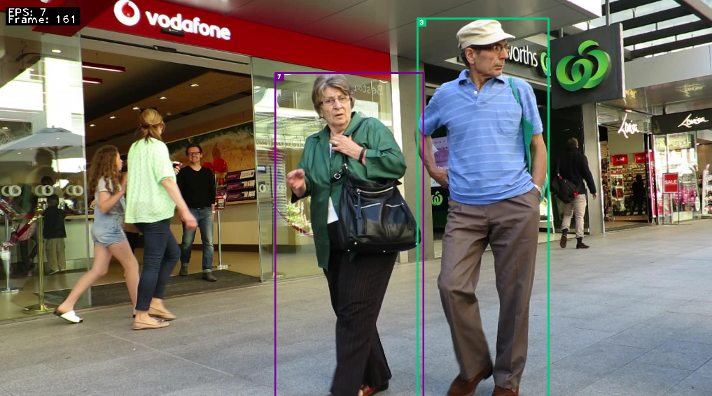

# Deep SORT

## Introduction

This repository contains code for *Simple Online and Realtime Tracking with a Deep Association Metric* (Deep SORT).

It extends [the original DeepSORT](https://github.com/nwojke/deep_sort) algorithm to provide
improved detections and Deep REID mechanisms.

## Data

The project uses [Multiple Object Tracking Benchmark](https://motchallenge.net/) for evaluation.

The project is using the following videos:
- KITTI-17
- MOT16-09
- MOT16-11
- PETS09-S2L1
- TUD-Campus
- TUD-Stadtmitte

MOT is published under [Creative Commons Attribution-NonCommercial-ShareAlike 3.0 License](https://creativecommons.org/licenses/by-nc-sa/3.0/).

| MOT16-11                                   | MOT16-06                                   | MOT16-13                                   | MOT16-01                                   | MOT16-14                                   |
|--------------------------------------------|--------------------------------------------|--------------------------------------------|--------------------------------------------|--------------------------------------------|
|  |  |  |  |  |

## Dependencies

The code is compatible with **Python 3.9+**.

The following dependencies are required to run the tracker:

* NumPy
* Sklearn
* OpenCV
* TensorFlow
* Pandas
* Torchvision

The full list of requirements can be found at [requirements.txt](./requirements.txt).

Moreover, the project depends on other projects, like:
- [MMDetection](https://github.com/open-mmlab/mmdetection)
- [Nanodet](https://github.com/RangiLyu/nanodet)
- [YoloV5](https://github.com/ultralytics/yolov5)
- [YoloV8](https://github.com/ultralytics/ultralytics)
- [Torchreid](https://github.com/KaiyangZhou/deep-person-reid)

Some of them are not published in `pip` and integrated via [git sumbodules system](https://git-scm.com/book/en/v2/Git-Tools-Submodules). You can find all declared submodules in [.gitmodules](./.gitmodules) or under [the dependencies folder](./dependencies).

## Running

### Setup

First of all, it is necessary to **clone and setup** the project.

Running the commands from below will help you to achieve it:

```bash
pip install -r requirements.txt
python setup.py develop
```

After some time (about 20 - 30 minutes) the dependencies installation should be done.
Yay 🎉 We are good to start experimenting!

### Commands

The app supports 2 working modes:
- **Ground truth visualisation** that **does not start** the tracker but visualise ground truth from `gt` folder;
- **Tracker** runs the DeepSORT algorithm; this is _the main part of the project_.

Below is the example of how to run `ground truth visualisation`.

```bash
deep-sort ground-truth ./data/sequences/MOT16-11
```

You, most likely, will see something similar to the image below:


The next example runs the `tracker`:

```bash
deep-sort run ./data/sequences -d det -e HOTA DetA AssA F1 Precision Recall 
```

You should see a picture similar to the next image:


_Note:_ Check out `deep-sort -h` for a detailed overview of available options.

## Source files overview

### Detection


Detections logic is located under [the `deep_sort.detector` package](./src/deep_sort/detector).
There are 2 central abstractions in detections mechanism: _Detection_ and _DetectionsProvider_.

_DetectionsProvider_ helps to abstract a specific detections logic under a single facade.
Every provider should return _a list of Detections_ in a frame.
The frame is described by an image (raw _np.ndarray_ matrix) and a frame id.
A list of detections helps to identify an origin of every detection,
i.e. where the particular detection is located in the frame, and a confidence score.

There are a few classes implementing __DetectionsProvider__. Let's take a look at them.

_Please, do note, `--n_init 0` is used during the evaluation stage to initialise tracks as soon as possible._

#### FileDetectionsProvider [from original DeepSORT algorithm]


_FileDetectionsProvider_ is the logic that **was used in the original DeepSORT** version of the project.
It reads the `det/det.txt` file and extract detections from it.

Command to run the sequence in the given configuration is:

```bash
deep-sort run ./data/sequences -d det -e F1 Precision Recall --n_init 0
```

During the evaluation there is a noticeable amount of mis-detections.


**Final score**

```text
                    |F1        |Precision |Recall    |
KITTI-17            |   0.72068|    0.8506|   0.62518|
MOT16-09            |   0.54102|   0.93847|   0.38006|
MOT16-11            |   0.60966|   0.98326|   0.44179|
PETS09-S2L1         |    0.7887|   0.70876|   0.88896|
TUD-Campus          |   0.72296|   0.77215|   0.67967|
TUD-Stadtmitte      |   0.72562|   0.72719|   0.72405|
COMBINED            |   0.68477|   0.83007|   0.62329|
```

#### YoloV5DetectionsProvider


This _DetectionsProvider_ implements [Yolo V5](https://github.com/ultralytics/yolov5) object detection model.

This project implements `YoloV5` as a submodule.

Detector supports the following checkpoints:
- Nano, aka [YOLOv5n](https://github.com/ultralytics/yolov5/releases/download/v7.0/yolov5n.pt)
- Small, aka [YOLOv5s](https://github.com/ultralytics/yolov5/releases/download/v7.0/yolov5s.pt)
- Medium, aka [YOLOv5m](https://github.com/ultralytics/yolov5/releases/download/v7.0/yolov5m.pt)
- Large, aka [YOLOv5l](https://github.com/ultralytics/yolov5/releases/download/v7.0/yolov5l.pt)
- Nano6, aka [YOLOv5n6](https://github.com/ultralytics/yolov5/releases/download/v7.0/yolov5n6.pt)

All checkpoints are available in [`data/yolov5_binaries`](./dependencies/yolov5_binaries). However, if you were not able
to locate some checkpoints, please, do visit the links above or YoloV5 official repository.

**YoloV5N**

Command to run the sequence in the given configuration is:

```bash
deep-sort run ./data/sequences -e F1 Precision Recall -d yolov5n --n_init 0
```

A lot of people have not been recognized.


FPS score also dropped dramatically across the whole dataset (almost twice). Though, please, approach this and
any further notes about FPS drops with a reasonable pragmatism: **the local setup which is used for this project
is CPU-bounded as does not support CUDA**. Only side-by-side comparison is performed locally, the final scores
are measured on _Google Colab_ to utilise GPU.

**Final scores**

```text
                    |F1        |Precision |Recall    |
KITTI-17            |   0.34803|   0.83799|   0.21962|
MOT16-09            |   0.35138|   0.96578|   0.21476|
MOT16-11            |    0.4939|   0.97401|   0.33083|
PETS09-S2L1         |   0.61212|   0.94028|   0.45375|
TUD-Campus          |   0.57418|   0.93125|   0.41504|
TUD-Stadtmitte      |   0.66321|   0.99139|   0.49827|
COMBINED            |   0.50714|   0.94012|   0.35538|
```

**YoloV5N6**

Command to run the sequence in the given configuration is:

```bash
deep-sort run ./data/sequences -e F1 Precision Recall -d yolov5n6 --n_init 0
```

Seems like this implementation provides more detections.


Performs really badly on [`KITTI17`](./data/sequences/KITTI-17)


**Final scores**

```text
                    |F1        |Precision |Recall    |
KITTI-17            |   0.38761|   0.89418|   0.24744|
MOT16-09            |   0.34508|   0.97522|   0.20963|
MOT16-11            |   0.48004|   0.96793|   0.31916|
PETS09-S2L1         |   0.51717|   0.94104|   0.35657|
TUD-Campus          |   0.69272|   0.95588|   0.54318|
TUD-Stadtmitte      |   0.71792|    0.9954|   0.56142|
COMBINED            |   0.52342|   0.95494|    0.3729|
```

**YoloV5S**

Command to run the sequence in the given configuration is:

```bash
deep-sort run ./data/sequences -e F1 Precision Recall -d yolov5s --n_init 0
```

Much more accurate than `nano` models.


**Final scores**

```text
                    |F1        |Precision |Recall    |
KITTI-17            |   0.56972|   0.89097|   0.41874|
MOT16-09            |   0.48913|   0.96685|   0.32737|
MOT16-11            |   0.58584|   0.96238|   0.42108|
PETS09-S2L1         |   0.82626|   0.93609|    0.7395|
TUD-Campus          |    0.6831|   0.92823|   0.54039|
TUD-Stadtmitte      |   0.81384|   0.98765|   0.69204|
COMBINED            |   0.66131|   0.94536|   0.52319|
```

**YoloV5M**

Command to run the sequence in the given configuration is:

```bash
deep-sort run ./data/sequences -e F1 Precision Recall -d yolov5m --n_init 0
```

Good quality of detections.


Moreover, on **CPU-bounded** devices there are about ~4-5 FPS,
which should be better on devices with available GPU and CUDA processing.

**Final scores**

```text
                    |F1        |Precision |Recall    |
KITTI-17            |   0.63188|   0.89757|   0.48755|
MOT16-09            |   0.58421|   0.95429|   0.42096|
MOT16-11            |   0.65607|   0.95539|   0.49956|
PETS09-S2L1         |   0.87007|   0.92026|   0.82507|
TUD-Campus          |   0.75042|   0.94118|   0.62396|
TUD-Stadtmitte      |   0.84325|   0.98837|   0.73529|
COMBINED            |   0.72265|   0.94284|   0.59873|
```

❗️ It seems that this model _outperforms_ the original algorithm by **all metrics**.

**YoloV5L**

Command to run the sequence in the given configuration is:

```bash
deep-sort run ./data/sequences -e F1 Precision Recall -d yolov5l --n_init 0
```

Outperforms all other `YOLO` models. However, not applicable in runtime
**at least on CPU-bounded** devices. Yet, some techniques as resizing or
buffering can help to improve performance if this model is required for usage.


**Final scores**

```text
                    |F1        |Precision |Recall    |
KITTI-17            |    0.6747|   0.91919|   0.53294|
MOT16-09            |   0.64809|   0.94463|   0.49325|
MOT16-11            |   0.68928|   0.95127|   0.54044|
PETS09-S2L1         |   0.88497|    0.9073|   0.86372|
TUD-Campus          |   0.75208|   0.93388|   0.62953|
TUD-Stadtmitte      |   0.85617|   0.98101|   0.75952|
COMBINED            |   0.75088|   0.93955|   0.63657|
```

#### NanodetDetectionsProvider


[NanodetDetectionsProvider](src/deep_sort/detector/nanodet_detections_provider.py)
is using [Nanodet](https://github.com/RangiLyu/nanodet) model.

⚠️⚠️⚠️ Unfortunately, this library does not work on MacOS, therefore `Nanodet` used in this project is a _patched_ version.

This is the patch that was sent to the authors of `Nanodet`:
- [#516 Guard CUDA calls with an explicit check](https://github.com/RangiLyu/nanodet/pull/516)

_NanodetDetectionsProvider_ supports the following checkpoints:
- Legacy M
- PlusM320
- PlusM15X320
- PlusM416
- PlusM15X416 

**Legacy M**

Command to run the sequence in the given configuration is:

```bash
deep-sort run ./data/sequences -e F1 Precision Recall -d nanodet_legacy --n_init 0
```

Runs bad on: `PETS09-S2L1` and `MOT16-11` almost not detecting anything


**Final scores**

```text
                    |F1        |Precision |Recall    |
KITTI-17            |       0.0|       1.0|       0.0|
MOT16-09            |  0.047177|       1.0|  0.024158|
MOT16-11            |  0.021341|   0.95192|  0.010791|
PETS09-S2L1         |  0.025127|   0.93443|  0.012735|
TUD-Campus          |     0.205|       1.0|   0.11421|
TUD-Stadtmitte      |  0.055509|       1.0|  0.028547|
COMBINED            |  0.059026|   0.98106|   0.03174|
```

**PlusM320**

Command to run the sequence in the given configuration is:

```bash
deep-sort run ./data/sequences -e F1 Precision Recall -d nanodet_plusm320 --n_init 0
```

Still runs terrible on `PETS09-S2L1`


**Final scores**

```text
                    |F1        |Precision |Recall    |
KITTI-17            |       0.0|       1.0|       0.0|
MOT16-09            |   0.03329|   0.98889|   0.01693|
MOT16-11            |  0.076786|   0.95325|  0.040004|
PETS09-S2L1         | 0.0013396|       1.0|0.00067024|
TUD-Campus          |   0.19598|       1.0|   0.10864|
TUD-Stadtmitte      |    0.1563|       1.0|  0.084775|
COMBINED            |  0.077283|   0.99036|  0.041836|
```

**PlusM1.5X320**

Command to run the sequence in the given configuration is:

```bash
deep-sort run ./data/sequences -e F1 Precision Recall -d nanodet_plusm15x320 --n_init 0
```

Performs better `PETS09-S2L1` but still far away from idea. Perhaps,
the objects in the frame are too small for this model.


**Final scores**

```text
                    |F1        |Precision |Recall    |
KITTI-17            | 0.0029197|       0.5| 0.0014641|
MOT16-09            |  0.062581|   0.96591|  0.032338|
MOT16-11            |    0.1272|   0.93572|  0.068236|
PETS09-S2L1         | 0.0080107|       1.0| 0.0040214|
TUD-Campus          |   0.30189|   0.98462|   0.17827|
TUD-Stadtmitte      |   0.11111|       1.0|  0.058824|
COMBINED            |   0.10228|   0.89771|  0.057193|
```

**PlusM416**

Command to run the sequence in the given configuration is:

```bash
deep-sort run ./data/sequences -e F1 Precision Recall -d nanodet_plusm416 --n_init 0
```

Cannot detect small objects

| Small objects                                                               | Big objects                                                                |
|-----------------------------------------------------------------------------|----------------------------------------------------------------------------|
|  |  |

**Final scores**

```text
                    |F1        |Precision |Recall    |
KITTI-17            |       0.0|       1.0|       0.0|
MOT16-09            |  0.082771|   0.99561|  0.043181|
MOT16-11            |   0.15543|   0.92951|  0.084805|
PETS09-S2L1         | 0.0071238|       1.0| 0.0035746|
TUD-Campus          |   0.26087|   0.98182|   0.15042|
TUD-Stadtmitte      |    0.2445|       1.0|   0.13927|
COMBINED            |   0.12511|   0.98449|  0.070209|
```

**PlusM1.5X416**

Command to run the sequence in the given configuration is:

```bash
deep-sort run ./data/sequences -e F1 Precision Recall -d nanodet_plusm15x416 --n_init 0
```

The best performance across all `nanodets`. However, the final quality is
still not enough. Though it is worth mentioning that frame rate is much
better than using `Yolo`.


**Final scores**

```text
                    |F1        |Precision |Recall    |
KITTI-17            | 0.0058394|       1.0| 0.0029283|
MOT16-09            |   0.10261|   0.95638|  0.054213|
MOT16-11            |   0.21776|   0.95752|   0.12285|
PETS09-S2L1         |  0.015954|   0.97297| 0.0080429|
TUD-Campus          |   0.31308|   0.97101|   0.18663|
TUD-Stadtmitte      |   0.36723|       1.0|   0.22491|
COMBINED            |   0.17041|   0.97631|  0.099929|
```

#### MMDetectionDetectionsProvider


_MMDetectionDetectionsProvider_ uses [MMDetection](https://github.com/open-mmlab/mmdetection) toolbox.

Supported models:
- [YoloXT](https://github.com/open-mmlab/mmdetection/blob/main/configs/yolox/README.md)
- [YoloXS](https://github.com/open-mmlab/mmdetection/blob/main/configs/yolox/README.md)
- [YoloXL](https://github.com/open-mmlab/mmdetection/blob/main/configs/yolox/README.md)
- [MobileNetV2](https://github.com/open-mmlab/mmdetection/blob/main/configs/yolo/README.md)
- [DarkNet53608](https://github.com/open-mmlab/mmdetection/blob/main/configs/yolo/README.md)


⚠️ Please, do keep in mind that due to the large size of weights/checkpoints they won't be provided with this repo.
Do download them from the `MMDetection` repository.

⚠️⚠️ Use `--extra` flag to pass path to the model weights.

**DarkNet-53**

Command to run the sequence in the given configuration is:

```bash
deep-sort run ./data/sequences -e F1 Precision Recall -d mmdet_darknet --n_init 0 --extra path_to_darknet_model
```

Detections quality is amazing but performance has some space for improvements.


**Final scores**

```text
                    |F1        |Precision |Recall    |
KITTI-17            |   0.72853|    0.7649|   0.69546|
MOT16-09            |   0.69262|   0.92555|   0.55336|
MOT16-11            |   0.67816|    0.9424|   0.52965|
PETS09-S2L1         |   0.84404|    0.8882|   0.80407|
TUD-Campus          |   0.76066|    0.9243|   0.64624|
TUD-Stadtmitte      |   0.82335|   0.99631|   0.70156|
COMBINED            |   0.75456|   0.90694|   0.65506|
```

**MobileNet V2**

Command to run the sequence in the given configuration is:

```bash
deep-sort run ./data/sequences -e F1 Precision Recall -d mmdet_mobilenetv2 --n_init 0 --extra path_to_mobilenet_model
```


**Final scores**

```text
                    |F1        |Precision |Recall    |
KITTI-17            |   0.61736|   0.94562|   0.45827|
MOT16-09            |   0.49639|   0.97225|   0.33327|
MOT16-11            |   0.50458|   0.95879|   0.34238|
PETS09-S2L1         |   0.67898|   0.87549|   0.55451|
TUD-Campus          |   0.60232|   0.98113|   0.43454|
TUD-Stadtmitte      |   0.62722|   0.99251|   0.45848|
COMBINED            |   0.58781|    0.9543|   0.43024|
```


**YoloXT**

Command to run the sequence in the given configuration is:

```bash
deep-sort run ./data/sequences -e F1 Precision Recall -d mmdet_yoloxt --n_init 0 --extra path_to_yolox_model
```

Super impressive for a `tiny` model as it performs better than the original algorithm.


**Final scores**

```text
                    |F1        |Precision |Recall    |
KITTI-17            |   0.56888|   0.88037|    0.4202|
MOT16-09            |   0.53987|   0.96521|   0.37474|
MOT16-11            |   0.62991|    0.9569|   0.46948|
PETS09-S2L1         |   0.85424|   0.93142|   0.78887|
TUD-Campus          |   0.74333|   0.92531|   0.62117|
TUD-Stadtmitte      |   0.85867|   0.98326|   0.76211|
COMBINED            |   0.69915|   0.94041|   0.57276|
```

**YoloXS**

Command to run the sequence in the given configuration is:

```bash
deep-sort run ./data/sequences -e F1 Precision Recall -d mmdet_yoloxs --n_init 0 --extra path_to_yolox_model
```

Performance is a bit worse but still _tolerable_ on the **CPU-bounded** devices. 


**Final scores**

```text
                    |F1        |Precision |Recall    |
KITTI-17            |   0.75043|   0.91932|   0.63397|
MOT16-09            |   0.67437|   0.97275|   0.51607|
MOT16-11            |    0.6938|   0.96175|   0.54262|
PETS09-S2L1         |   0.88307|   0.89234|   0.87399|
TUD-Campus          |   0.79808|   0.93962|   0.69359|
TUD-Stadtmitte      |   0.87458|   0.98378|    0.7872|
COMBINED            |   0.77905|   0.94493|   0.67457|
```

**YoloXL**

Command to run the sequence in the given configuration is:

```bash
deep-sort run ./data/sequences -e F1 Precision Recall -d mmdet_yoloxl --n_init 0 --extra path_to_yolox_model
```


**Final scores**

```text
                    |F1        |Precision |Recall    |
KITTI-17            |    0.8263|   0.92714|   0.74524|
MOT16-09            |   0.77234|   0.95103|   0.65018|
MOT16-11            |    0.7321|   0.93389|   0.60203|
PETS09-S2L1         |   0.89697|   0.88497|   0.90929|
TUD-Campus          |   0.85542|   0.93115|   0.79109|
TUD-Stadtmitte      |   0.87992|   0.97476|    0.8019|
COMBINED            |   0.82718|   0.93382|   0.74996|
```

#### YoloV8DetectionsProvider


_YoloV8DetectionsProvider_ uses [YoloV8](https://github.com/ultralytics/ultralytics) model.

Model supports the following checkpoints:
- nano
- small
- medium
- large

⚠️ YoloV8 downloads models automatically.

**YoloV8N**

Command to run the sequence in the given configuration is:

```bash
deep-sort run ./data/sequences -e F1 Precision Recall -d yolov8n --n_init 0
```

Good performance, runs about ~90-100% of the original speed, i.e. 10% FPS drop only.


**Final scores**

```text
                    |F1        |Precision |Recall    |
KITTI-17            |    0.4572|   0.87917|   0.30893|
MOT16-09            |   0.45476|   0.95668|   0.29827|
MOT16-11            |    0.5959|    0.9555|   0.43296|
PETS09-S2L1         |   0.69073|   0.93003|   0.54937|
TUD-Campus          |   0.66906|   0.94416|   0.51811|
TUD-Stadtmitte      |    0.7862|   0.99339|   0.65052|
COMBINED            |   0.60898|   0.94316|   0.45969|
```

Metrics are impressive for `nano` model.

**YoloV8S**

Command to run the sequence in the given configuration is:

```bash
deep-sort run ./data/sequences -e F1 Precision Recall -d yolov8s --n_init 0
```


A lot of detections for a small model as well.


**Final scores**

```text
                    |F1        |Precision |Recall    |
KITTI-17            |    0.5957|   0.89443|   0.44656|
MOT16-09            |   0.55655|   0.95773|   0.39224|
MOT16-11            |   0.65238|    0.9521|   0.49618|
PETS09-S2L1         |   0.75676|   0.93789|   0.63427|
TUD-Campus          |   0.73129|   0.93886|   0.59889|
TUD-Stadtmitte      |   0.82033|   0.98075|   0.70502|
COMBINED            |    0.6855|   0.94363|   0.54553|
```

❗️ This model **outperforms** the original detections algorithm.
Perhaps, bigger models as `medium`, `large` or `extra large` definitely works better than the original model.

**YoloV8M**

Command to run the sequence in the given configuration is:

```bash
deep-sort run ./data/sequences -e F1 Precision Recall -d yolov8m --n_init 0
```

The performance is a bit off, at least on **CPU-bounded** devices. Though, it seems
it should be just fine on GPU ones.


**Final scores**

```text
                    |F1        |Precision |Recall    |
KITTI-17            |   0.71159|   0.92093|    0.5798|
MOT16-09            |    0.6543|   0.95852|   0.49667|
MOT16-11            |   0.68223|   0.94571|   0.53357|
PETS09-S2L1         |   0.86067|   0.92793|    0.8025|
TUD-Campus          |    0.7743|   0.94758|    0.6546|
TUD-Stadtmitte      |   0.83913|   0.98485|   0.73097|
COMBINED            |    0.7537|   0.94759|   0.63302|
```

**YoloV8L**

Command to run the sequence in the given configuration is:

```bash
deep-sort run ./data/sequences -e F1 Precision Recall -d yolov8m --n_init 0
```

It seems real-time performance would not be amazing even on GPU ones.


**Final scores**

```text
                    |F1        |Precision |Recall    |
KITTI-17            |   0.73033|   0.92188|   0.60469|
MOT16-09            |   0.68475|   0.95729|     0.533|
MOT16-11            |    0.6989|   0.94912|   0.55308|
PETS09-S2L1         |   0.87608|    0.9032|   0.85054|
TUD-Campus          |   0.79808|   0.93962|   0.69359|
TUD-Stadtmitte      |    0.8595|   0.98113|   0.76471|
COMBINED            |   0.77461|   0.94204|    0.6666|
```

#### HogDetectionsProvider


_HogDetectionsProvider_ uses [HOGDescriptor](https://docs.opencv.org/4.x/d5/d33/structcv_1_1HOGDescriptor.html) and
[detectMultiScale](https://docs.opencv.org/4.8.0/d1/de5/classcv_1_1CascadeClassifier.html#aaf8181cb63968136476ec4204ffca498)
from [OpenCV](https://opencv.org/).

This provider was made to check whether "classic" algorithm can offer comparable results. Spoiler:
it is working not that bad as you may expect. Actually, quite surprising for a classical algorithm.

```bash
deep-sort run ./data/sequences -e F1 Precision Recall -d hog --n_init 0
```


**Final scores**

```text
                    |F1        |Precision |Recall    |
KITTI-17            |       0.0|       1.0|       0.0|
MOT16-09            |  0.083475|   0.39967|  0.046605|
MOT16-11            |  0.028998|   0.33656|  0.015152|
PETS09-S2L1         |       0.0|       1.0|       0.0|
TUD-Campus          |  0.026316|    0.2381|  0.013928|
TUD-Stadtmitte      | 0.0014378| 0.0042553|0.00086505|
COMBINED            |  0.023371|   0.49643|  0.012758|
```

#### GroundTruthDetectionsProvider


_GroundTruthDetectionsProvider_ returns ground truth as detections. It helps to check tracking metrics,
and should result 1.0 for detections evaluation.

⚠️ Though we are evaluating detections, **tracking** is still running and slightly affect
the final score as detections appears not immediately. 
It takes a little time (i.e. a few frames) from tracks to initialise.

```bash
deep-sort run ./data/sequences -e F1 Precision Recall -d gt --n_init 0
```

**Final scores**

```text
                    |F1        |Precision |Recall    |
KITTI-17            |   0.98827|   0.98972|   0.98682|
MOT16-09            |   0.99581|   0.99676|   0.99486|
MOT16-11            |    0.9934|   0.99432|   0.99248|
PETS09-S2L1         |    0.9962|   0.99687|   0.99553|
TUD-Campus          |   0.98319|   0.98873|   0.97772|
TUD-Stadtmitte      |    0.9883|   0.99044|   0.98616|
COMBINED            |   0.99086|   0.99281|   0.98893|
```

### Features extraction


Features extractor is the main abstraction for converting a detection area into a feature vector. Those features play
important role for **REID**.

The API of a features extractor:

| Method                                                          | Description                                                                                                                                 |
|-----------------------------------------------------------------|---------------------------------------------------------------------------------------------------------------------------------------------|
| **extract(image: np.ndarray, boxes: list[Rect]) -> np.ndarray** | it accepts original image and found detections, and returns a list of features vectors. Feature vectors go in the same order as detections. |

#### Tensorflow V1 [from original DeepSORT work]


[TensorflowV1FeaturesExtractor](./src/deep_sort/features_extractor/tensorflow_v1_features_extractor.py) provides
a tensorflow model to extract feature vectors from detections.

Command to run the sequence in the given configuration is:

```bash
deep-sort run ./data/sequences -e HOTA DetA AssA -d gt
```

**Scores**

```text
                    |HOTA      |DetA      |AssA      |
KITTI-17            |   0.71602|   0.78332|     0.655|
MOT16-09            |   0.83054|   0.91735|   0.75269|
MOT16-11            |   0.90087|   0.90305|   0.90062|
PETS09-S2L1         |   0.78951|   0.85509|   0.73012|
TUD-Campus          |   0.81401|   0.80881|   0.81978|
TUD-Stadtmitte      |   0.87434|   0.89017|   0.86596|
COMBINED            |   0.82088|   0.85963|   0.78736|
```

#### Torchreid


_TorchreidFeaturesExtractor_ is using [torchreid](https://github.com/KaiyangZhou/deep-person-reid). 

`Torchreid` supports multiple models, including:
- Shufflenet
- Mobilenet
- Mobilenet 1.4x
- Mlfn
- Osnet
- Osnet 0.75x
- OsnetIbn
- OsnetAin
- OsnetAin 0.75x

**Shufflenet**

Command to run the sequence in the given configuration is:

```bash
deep-sort run ./data/sequences -e HOTA DetA AssA -fe torchreid_shufflenet -d gt
```

**Final scores**

```text
                    |HOTA      |DetA      |AssA      |
KITTI-17            |   0.71939|   0.78704|   0.65796|
MOT16-09            |   0.73834|   0.91089|   0.59933|
MOT16-11            |   0.82107|   0.90406|   0.74789|
PETS09-S2L1         |   0.69533|   0.85152|   0.56885|
TUD-Campus          |   0.79351|   0.81319|   0.77497|
TUD-Stadtmitte      |   0.70441|   0.88508|   0.56317|
COMBINED            |   0.74534|   0.85863|   0.65203|
```

**Mobilenet**

Command to run the sequence in the given configuration is:

```bash
deep-sort run ./data/sequences -e HOTA DetA AssA -fe torchreid_mobilenet -d gt
```

**Final scores**

```text
                    |HOTA      |DetA      |AssA      |
KITTI-17            |   0.78148|   0.78184|   0.78177|
MOT16-09            |   0.80455|   0.91886|    0.7054|
MOT16-11            |   0.83794|   0.90429|    0.7786|
PETS09-S2L1         |   0.72293|   0.85423|   0.61308|
TUD-Campus          |   0.79351|   0.81319|   0.77497|
TUD-Stadtmitte      |   0.79706|    0.8877|   0.72372|
COMBINED            |   0.78958|   0.86002|   0.72959|
```

**Mobilenet 1.4x**

Command to run the sequence in the given configuration is:

```bash
deep-sort run ./data/sequences -e HOTA DetA AssA -fe torchreid_mobilenet14x -d gt
```

**Final scores**

```text
                    |HOTA      |DetA      |AssA      |
KITTI-17            |   0.78385|   0.78226|   0.78584|
MOT16-09            |   0.78386|   0.91873|   0.66944|
MOT16-11            |   0.83769|   0.90423|    0.7782|
PETS09-S2L1         |   0.68079|   0.85129|   0.54559|
TUD-Campus          |   0.78999|   0.81248|   0.76877|
TUD-Stadtmitte      |   0.79706|    0.8877|   0.72372|
COMBINED            |   0.77887|   0.85945|   0.71193|
```

**MLFN**

Command to run the sequence in the given configuration is:

```bash
deep-sort run ./data/sequences -e HOTA DetA AssA -fe torchreid_mlfn -d gt
```

**Final scores**

```text
                    |HOTA      |DetA      |AssA      |
KITTI-17            |   0.75342|   0.78811|   0.72059|
MOT16-09            |   0.75076|    0.9163|   0.61606|
MOT16-11            |   0.82203|   0.90421|   0.74948|
PETS09-S2L1         |   0.67928|   0.84723|   0.54672|
TUD-Campus          |   0.79351|   0.81319|   0.77497|
TUD-Stadtmitte      |   0.70249|   0.88332|   0.56154|
COMBINED            |   0.75025|   0.85873|   0.66156|
```

**Osnet**

Command to run the sequence in the given configuration is:

```bash
deep-sort run ./data/sequences -e HOTA DetA AssA -fe torchreid_osnet -d gt
```

**Final scores**

```text
                    |HOTA      |DetA      |AssA      |
KITTI-17            |   0.70801|   0.78305|   0.64132|
MOT16-09            |   0.84397|   0.91597|   0.77847|
MOT16-11            |   0.89317|   0.90303|   0.88547|
PETS09-S2L1         |   0.82948|   0.85326|   0.80744|
TUD-Campus          |   0.75041|   0.80596|   0.69969|
TUD-Stadtmitte      |   0.84106|   0.88805|   0.80391|
COMBINED            |   0.81102|   0.85822|   0.76938|
```

**Osnet 0.75x**

Command to run the sequence in the given configuration is:

```bash
deep-sort run ./data/sequences -e HOTA DetA AssA -fe torchreid_osnet075 -d gt
```

**Final scores**

```text
                    |HOTA      |DetA      |AssA      |
KITTI-17            |   0.72316|    0.7851|   0.66727|
MOT16-09            |   0.84918|    0.9173|   0.78692|
MOT16-11            |   0.89959|   0.90285|   0.89838|
PETS09-S2L1         |   0.73093|   0.85319|   0.62715|
TUD-Campus          |   0.81401|   0.80881|   0.81978|
TUD-Stadtmitte      |   0.84109|   0.88814|   0.80387|
COMBINED            |   0.80966|   0.85923|   0.76723|
```

**Osnet Ibn**

Command to run the sequence in the given configuration is:

```bash
deep-sort run ./data/sequences -e HOTA DetA AssA -fe torchreid_osnetibn -d gt
```

**Final scores**

```text
                    |HOTA      |DetA      |AssA      |
KITTI-17            |   0.76833|   0.77976|   0.75796|
MOT16-09            |   0.89489|    0.9175|   0.87357|
MOT16-11            |   0.90365|   0.90325|   0.90603|
PETS09-S2L1         |   0.81309|   0.85437|   0.77482|
TUD-Campus          |   0.81401|   0.80881|   0.81978|
TUD-Stadtmitte      |   0.79701|   0.88758|   0.72371|
COMBINED            |   0.83183|   0.85855|   0.80931|
```

**Osnet Ain**

Command to run the sequence in the given configuration is:

```bash
deep-sort run ./data/sequences -e HOTA DetA AssA -fe torchreid_osnetain -d gt
```

**Final scores**

```text
                    |HOTA      |DetA      |AssA      |
KITTI-17            |   0.74956|   0.77895|   0.72198|
MOT16-09            |   0.83505|   0.91511|   0.76292|
MOT16-11            |   0.90592|   0.90228|   0.91166|
PETS09-S2L1         |   0.79118|    0.8518|   0.73624|
TUD-Campus          |   0.81401|   0.80881|   0.81978|
TUD-Stadtmitte      |   0.84233|   0.88567|    0.8084|
COMBINED            |   0.82301|    0.8571|    0.7935|
```

**Osnet Ain 0.75**

Command to run the sequence in the given configuration is:

```bash
deep-sort run ./data/sequences -e HOTA DetA AssA -fe torchreid_osnetain075 -d gt
```

**Final scores**

```text
                    |HOTA      |DetA      |AssA      |
KITTI-17            |   0.77272|   0.78178|   0.76444|
MOT16-09            |   0.89956|   0.91725|   0.88296|
MOT16-11            |   0.91164|   0.90272|   0.92269|
PETS09-S2L1         |   0.78861|   0.85357|   0.72973|
TUD-Campus          |   0.81401|   0.80881|   0.81978|
TUD-Stadtmitte      |   0.89911|   0.88842|   0.91666|
COMBINED            |   0.84761|   0.85876|   0.83938|
```

### Segmentation


Implementation details of segmentation logic is located under [`deep_sort/segmentation` folder.](./src/deep_sort/segmentation)

The idea is similar to [Detections Provider](#detection), the only difference that [Segmentation](./src/deep_sort/segmentation/segmentation.py)
has an additional method to provide **a segmentation mask**.

#### Detectron2


_Detectron2SegmentationsProvider_ relies on [detectron2 by Facebook](https://github.com/facebookresearch/detectron2).

To install `detectron2` you need to run the command below:

```bash
python -m pip install 'git+https://github.com/facebookresearch/detectron2.git'
# (add --user if you don't have permission)

# Or, to install it from a local clone:
git clone https://github.com/facebookresearch/detectron2.git
python -m pip install -e detectron2

# On macOS, you may need to prepend the above commands with a few environment variables:
CC=clang CXX=clang++ ARCHFLAGS="-arch x86_64" python -m pip install ...
```

Example, of the command that runs segmentation:

```text
deep-sort run ./data/sequences -e HOTA DetA AssA FPS -s detectron2 -fe torchreid_osnet075 --visualise_segmentations
```

Just remember to run segmentation you need to specify `-s` instead of `-d`.

Use `--visualise_segmentations` to see segmentation visualised on the image.

| Screen 1                                                           | Screen 2                                                           | Screen 3                                                           |
|--------------------------------------------------------------------|--------------------------------------------------------------------|--------------------------------------------------------------------|
|  |  |  |

**Scores for KITTI-17**

```text
                    |HOTA      |AssA      |DetA      |F1        |Recall    |Precision |FPS       |
KITTI-17            |   0.48867|   0.49342|   0.48488|   0.75857|   0.82577|   0.70149|    6.2897|
COMBINED            |   0.48867|   0.49342|   0.48488|   0.75857|   0.82577|   0.70149|    6.2897|
```
 
### Misc

#### Geometry, Rect


Rect represents a rectangular area and helps to deal with their geometry. It provides a few helpful methods:

| Method                                                                  | Description                                                                                                                                                    |
|-------------------------------------------------------------------------|----------------------------------------------------------------------------------------------------------------------------------------------------------------|
| **width: float**                                                        | returns width of the rect                                                                                                                                      |
| **height: float**                                                       | returns height of the rect                                                                                                                                     |
| **top: float**                                                          | returns first horizontal pixels position (aka top edge) in the original image                                                                                  |
| **left: float**                                                         | returns first vertical pixels position (aka left edge) in the original image                                                                                   |
| **right: float**                                                        | returns last vertical pixels position (aka right edge) in the original image                                                                                   |
| **bottom: float**                                                       | returns last horizontal pixels position (aka bottom edge) in the original image                                                                                |
| **center_x: float**                                                     | returns horizontal central position                                                                                                                            |
| **center_y: float**                                                     | returns vertical central position                                                                                                                              |
| **aspect_ratio: float**                                                 | returns ratio of width to height, i.e. `width / height`                                                                                                        |
| **area: float**                                                         | returns rectangle area, i.e. `width * height`                                                                                                                  |
| **inset(left: float, top: float, right: float, bottom: float) -> Rect** | adds paddings to the current rect and returns a new rect with new paddings                                                                                     |
| **check_if_intersects(that: Rect) -> bool**                             | checks if 2 rectangles are intersecting                                                                                                                        | 
| **iou(hat: Rect) -> float**                                             | calculates intersection over union, the return value is always within **[0, 1]**                                                                               |
| **resize(target_width: float, target_height: float) -> Rect**           | scales current rect and returns a new one with the same aspect ratio as target_width over target_height                                                        |
| **clip(that: Rect) -> Rect**                                            | clips the other rect by the bounding boxes of the current rect or raises exception if the other box is completely outside the bounding box of the current rect |

Rect fixes an issue within the original [`deep sort`](https://github.com/nwojke/deep_sort). Bottom right corners of
the bounding boxes are calculated incorrectly which _may affect detection and metrics calculation quality_.

This is the Pull Request that fixes the issue:
- [#314 Fix bbox bottom right corner calculation](https://github.com/nwojke/deep_sort/pull/314)

#### App, Window


App provides flexible windows control system.

The API of a [`Window` class](./src/app/window/window.py is shown at the table below:

| Method                        | Description                         |
|-------------------------------|-------------------------------------|
| **title: str**                | returns the window title            |
| **size: tuple[int, int]**     | returns the window size             |
| **update(image: np.ndarray)** | draws the given image in the window |
| **destroy()**                 | destoys window                      |

There are a few windows implementations avilable in the project:
- [`VirtualWindow`](./src/app/window/virtual_window.py): provides no window
- [`OpenCVWindow`](./src/app/window/opencv_window.py): a desktop window provided using OpenCV
- `ColabWindow`: saves a video to a file, _available in Colab snippet_ 

**It is important to know that all Windows operations are excluded from FPS counting.**

## Metric

### HOTA

Metric used in this project is called _Higher Order Tracking Accuracy_ (aka HOTA).

The metric consists of a few sub metrics:

#### 1. Localization

Finds the spatial alignment between predicted detections and ground truth detections.
[_IOU_](https://en.wikipedia.org/wiki/Jaccard_index) is used to find localisation between **one** detection and **one**
ground truth object.


Overall Localization Accuracy (LocA) is calculated over all pairs across the **entire dataset**.

```math
LocA = \frac{1}{|TP|} \sum_{c \in TP} Loc-IOU(c)
```

In the codebase iou implemented in [iou utils](./src/utils/geometry/iou_utils.py) and [Rect](./src/utils/geometry/rect.py)

#### 2. Detection

Detection measures the alignment between all predicted detections and ground truth detections.
We rely on _localisation_ results to find the overlap between predictions and ground truth. To break the tie
when there are more than one prediction intersect with a ground truth _Hungarian algorithm_ (aka assignment problem algorithm) is used.

Implementation of the assignment algorithm is used from [scipy.linear_sum_assignment](https://docs.scipy.org/doc/scipy/reference/generated/scipy.optimize.linear_sum_assignment.html#scipy-optimize-linear-sum-assignment),
in the latest release of the library _Hungarian algorithm_ has been replaced with _Jonker-Volgenant algorithm_.

After running the algorithm we end up with matched and unmatched elements. We can divide them into 3 groups:
True Positives (intersection between the two sets of detections), False Positives (predicted detections that don’t match),
and False Negatives (ground-truth detections that don’t match).

Overall Detection Accuracy (aka DetA) is calcuated by using the count of TPs, FNs and FPs over the whole dataset.

```math
DetA=\frac{|TP|}{|TP|+|FP|+|FN|}
```

#### 3. Association

Show how well the tracking links detections **over time** into the **same identities**.

The intersection between two tracks can be found in a similar way as during the detection step, but with
a little difference: True Positive Associations (number of True Positive matches between the two tracks), 
False Positive Associations (any remaining detections in the predicted track which are either matched to other ground-truth tracks or none at all),
and False Negative Associations (any remaining detections in the ground-truth track).

See visual example of the definitions TPA, FNA and FPA:


Overall Association Accuracy (aka AssA) is calculated for **every** True Positive pair **across the entire dataset**.

```math
AssA=\frac{1}{|TP|} \sum_{c \in TP} \frac{|TPA(c)|}{|TPA(c)|+|FPA(c)|+|FNA(c)|}
```

#### Gathering sub-metrics together

Detection and association were defined using a _Hungarian matching_ based on a certain _Loc-IoU threshold_ (_α_). 
Since they both depend on the quality of localisation we calculate them over a range of different _α_ thresholds.

_HOTA_ for specific alpha a can be calculated as:

```math
HOTA_{\alpha}=\sqrt{DetA_{\alpha}*AssA_{\alpha}}
```

Overall _HOTA_ is a **discrete integral** over different alphas:

```math
HOTA=\int_{0 < \alpha \le 1} HOTA_{\alpha} \thickapprox \sum_{\alpha=0.05,\space \alpha += 0.05}^{0.95} HOTA_{\alpha}
```

#### Implementation

- [HotaMetric](./src/metrics/hota_metric.py)


#### References

- [How to evaluate tracking with the HOTA metricsPermalink](https://autonomousvision.github.io/hota-metrics/)
- [HOTA: A Higher Order Metric for Evaluating Multi-object Tracking](https://link.springer.com/article/10.1007/s11263-020-01375-2)
- [TrackEval](https://github.com/JonathonLuiten/TrackEval/blob/master/trackeval/metrics/hota.py)

### Confusion Matrix Metrics

This is implementation of metrics used primarily for detection assessments

#### Precision

```math
Precision=\frac{|TP|}{|TP|+|FP|}
```

#### Recall

```math
Recall=\frac{|TP|}{|TP|+|FN|}
```

#### F1

```math
F1=2 * \frac{Precision*Recall}{Precision+Recall}
```

#### Implementation

- [ConfusionMatrixMetric](./src/metrics/confusion_matrix_metric.py)

### Usage

You can enable evaluation in [the main script](./src/commands/deep_sort.py) using the command below:

```bash
deep-sort run ./data/sequences --eval HOTA DetA AssA F1 Recall Precision
```

Supported metrics are:
- HOTA
- DetA (calculated as a part of HOTA)
- AssA (calculated as a part of HOTA)
- F1
- Recall
- Precision

You will see a table similar to the table below:

```text
                    |HOTA      |DetA      |AssA      |F1        |Recall    |Precision |
KITTI-17            |   0.39411|    0.4061|   0.38431|   0.52665|   0.37511|   0.88362|
MOT16-09            |   0.30053|   0.27235|   0.33223|   0.41727|   0.26783|   0.94404|
MOT16-11            |   0.40245|   0.33696|   0.48102|    0.4623|   0.30172|   0.98828|
PETS09-S2L1         |    0.4469|   0.48727|   0.41129|   0.57651|   0.46904|   0.74787|
TUD-Campus          |    0.4007|   0.44327|   0.36568|   0.53687|   0.39358|    0.8442|
TUD-Stadtmitte      |    0.3568|   0.43991|   0.29182|   0.54371|   0.41616|   0.78402|
COMBINED            |   0.38358|   0.39764|   0.37772|   0.51055|   0.37057|   0.86534|
```

## Results

The main evaluation stages are published in [this _Colab_](https://colab.research.google.com/drive/1ie-1zJHsmBvdABeDZ1WxEGkbmMGSmr6j#scrollTo=K9Q7Uic6F0XP).


Moreover, video records for sequences are available under [`results` folder.](./results)

The results below were obtained on Colab as it **supports GPU-acceleration**. 

_Hyperparameters_ were the same for all runs:

| Parameter            | Value |
|----------------------|-------|
| min_confidence       | 0.8   |
| nms_max_overlap      | 1.0   |
| min_detection_height | 0     |
| max_cosine_distance  | 0.2   |
| nn_budget            | None  |
| max_iou_distance     | 0.7   |
| max_age              | 30    |
| n_init               | 3     |

### Original DeepSORT (Status QUO)

```text
                    |HOTA      |AssA      |DetA      |F1        |Recall    |Precision |FPS       |
KITTI-17            |   0.39411|   0.38431|    0.4061|   0.71491|   0.60029|   0.88362|    59.676|
MOT16-09            |   0.30053|   0.33223|   0.27235|   0.52728|    0.3658|   0.94404|    55.869|
MOT16-11            |   0.40245|   0.48102|   0.33696|   0.60129|   0.43209|   0.98828|    49.777|
PETS09-S2L1         |    0.4469|   0.41129|   0.48727|      0.81|   0.88338|   0.74787|    38.635|
TUD-Campus          |    0.4007|   0.36568|   0.44327|   0.73386|   0.64903|    0.8442|    57.563|
TUD-Stadtmitte      |    0.3568|   0.29182|   0.43991|   0.74671|    0.7128|   0.78402|    44.961|
COMBINED            |   0.38358|   0.37772|   0.39764|   0.68901|   0.60723|   0.86534|     51.08|
```

### Yolo V5 Small + Mobilenet

**Average FPS:** ~19 FPS

**Verdict:** 👎, the model works slightly worse than original DeepSORT

```text
                    |HOTA      |AssA      |DetA      |F1        |Recall    |Precision |FPS       |
KITTI-17            |   0.26456|   0.24383|   0.28771|   0.53265|   0.38214|   0.87879|    27.034|
MOT16-09            |   0.28191|   0.29082|   0.27403|   0.49284|   0.33061|   0.96771|    17.297|
MOT16-11            |   0.38404|   0.41388|   0.35823|   0.58527|   0.42141|   0.95764|     14.91|
PETS09-S2L1         |   0.41396|   0.33301|   0.51742|   0.82628|   0.73905|   0.93685|    16.619|
TUD-Campus          |   0.43408|   0.47445|   0.39799|   0.68078|    0.5376|   0.92788|    20.859|
TUD-Stadtmitte      |   0.50898|   0.51141|   0.50779|    0.8096|   0.68599|   0.98755|    19.899|
COMBINED            |   0.38126|    0.3779|   0.39053|   0.65457|   0.51613|   0.94274|    19.437|
```

### Yolo V5 Small + OS Net 0.75x

**Average FPS:** ~14 FPS

**Verdict:** 👍

```text
                    |HOTA      |AssA      |DetA      |F1        |Recall    |Precision |FPS       |
KITTI-17            |   0.28327|   0.28244|   0.28461|   0.53141|   0.37775|   0.89583|    17.276|
MOT16-09            |   0.33695|   0.42715|    0.2661|   0.48177|   0.32053|   0.96951|    13.608|
MOT16-11            |   0.44738|   0.56581|   0.35447|    0.5812|   0.41661|   0.96078|    12.167|
PETS09-S2L1         |   0.50412|   0.49909|   0.51076|    0.8235|   0.73123|   0.94241|     12.59|
TUD-Campus          |   0.46485|    0.5625|   0.38484|   0.66667|   0.52089|   0.92574|    16.268|
TUD-Stadtmitte      |   0.47007|   0.43868|   0.50501|   0.80594|    0.6808|   0.98745|    12.508|
COMBINED            |   0.41777|   0.46261|    0.3843|   0.64842|   0.50797|   0.94696|    14.069|
```

### Yolo V5 Medium + Mobilenet

**Average FPS:** ~15 FPS

**Verdict:** 👍, borderline go

```text
                    |HOTA      |AssA      |DetA      |F1        |Recall    |Precision |FPS       |
KITTI-17            |   0.35139|   0.35116|   0.35193|   0.61553|   0.46999|   0.89167|    21.759|
MOT16-09            |   0.32178|   0.29805|    0.3486|   0.58662|   0.42286|   0.95736|    13.699|
MOT16-11            |   0.39488|     0.373|    0.4211|   0.65713|   0.50055|   0.95627|    12.291|
PETS09-S2L1         |   0.37044|    0.2475|   0.56204|   0.86719|   0.82127|   0.91854|    13.208|
TUD-Campus          |   0.44722|   0.44803|   0.44714|   0.74707|   0.62117|   0.93697|     17.31|
TUD-Stadtmitte      |   0.54273|   0.54885|   0.53791|   0.83906|   0.72837|   0.98942|    15.827|
COMBINED            |   0.40474|   0.37777|   0.44479|   0.71877|   0.59403|   0.94171|    15.682|
```

### Yolo V5 Medium + OSNet 0.75x

**Average FPS:** ~12 FPS

**Verdict:** 👍, works really nice

```text
                    |HOTA      |AssA      |DetA      |F1        |Recall    |Precision |FPS       |
KITTI-17            |   0.36228|   0.37535|   0.34992|   0.61449|   0.46559|   0.90341|    15.345|
MOT16-09            |   0.38652|   0.43429|    0.3445|   0.58114|   0.41621|    0.9626|     11.64|
MOT16-11            |   0.44308|   0.47411|   0.41554|   0.65065|   0.49313|   0.95604|    10.497|
PETS09-S2L1         |   0.51778|   0.48084|   0.55944|   0.86756|   0.81881|   0.92248|    10.707|
TUD-Campus          |   0.40679|   0.38632|   0.43003|   0.73684|   0.60446|   0.94348|    13.958|
TUD-Stadtmitte      |   0.54143|   0.54776|   0.53656|   0.83633|   0.72491|   0.98821|     12.19|
COMBINED            |   0.44298|   0.44978|   0.43933|    0.7145|   0.58719|   0.94604|    12.389|
```

### Yolo V8 Small + Mobilenet 1.4x

**Average FPS:** ~17 FPS, though it seems a bit unstable

**Verdict:** 👎, HOTA is slightly worse

```text
                    |HOTA      |AssA      |DetA      |F1        |Recall    |Precision |FPS       |
KITTI-17            |   0.31209|   0.31215|   0.31233|   0.55767|   0.40703|   0.88535|      22.6|
MOT16-09            |   0.31903|   0.30911|   0.32989|   0.56176|   0.39623|    0.9648|    14.383|
MOT16-11            |   0.40477|   0.38946|   0.42326|   0.65277|   0.49684|   0.95137|    12.242|
PETS09-S2L1         |    0.3623|   0.30088|   0.44064|   0.75194|   0.62779|   0.93729|    16.081|
TUD-Campus          |   0.43168|   0.45225|   0.41317|   0.71698|   0.58217|   0.93304|     17.31|
TUD-Stadtmitte      |     0.449|   0.39554|    0.5118|   0.81275|   0.69464|   0.97927|     17.43|
COMBINED            |   0.37981|    0.3599|   0.40518|   0.67565|   0.53412|   0.94185|    16.674|
```

### Yolo V8 Small + OSNet 0.75x

**Average FPS:** ~13 FPS on average

**Verdict:** 👍, HOTA is better than in original work

```text
                    |HOTA      |AssA      |DetA      |F1        |Recall    |Precision |FPS       |
KITTI-17            |   0.31467|    0.3314|   0.29912|   0.54582|   0.39239|   0.89632|    16.924|
MOT16-09            |    0.3802|   0.45054|   0.32144|   0.54918|   0.38444|   0.96101|    12.339|
MOT16-11            |    0.4827|   0.55692|   0.41915|   0.64812|   0.49128|   0.95205|    10.874|
PETS09-S2L1         |   0.40245|   0.37643|    0.4334|   0.74451|   0.61685|    0.9388|    12.564|
TUD-Campus          |   0.46037|    0.5125|   0.41472|   0.71724|   0.57939|   0.94118|    15.085|
TUD-Stadtmitte      |   0.52672|   0.54985|   0.50687|   0.80611|   0.68512|   0.97899|    13.547|
COMBINED            |   0.42785|   0.46294|   0.39912|    0.6685|   0.52491|   0.94472|    13.556|
```

### Yolo V8 Nano + OSNet 0.75x

**Average FPS:** ~14 FPS on average

**Verdict:** 👎

```text
                    |HOTA      |AssA      |DetA      |F1        |Recall    |Precision |FPS       |
KITTI-17            |   0.21688|   0.23078|   0.20402|   0.41341|   0.27086|   0.87264|    19.172|
MOT16-09            |   0.30585|   0.38025|   0.24643|   0.44467|   0.28933|   0.96023|    13.145|
MOT16-11            |   0.42355|    0.4921|   0.36579|   0.58878|   0.42544|   0.95568|    11.919|
PETS09-S2L1         |   0.35368|   0.33704|   0.37388|   0.67439|   0.52681|   0.93683|    13.679|
TUD-Campus          |     0.428|   0.51847|   0.35442|   0.65336|   0.50139|    0.9375|    14.521|
TUD-Stadtmitte      |   0.51076|   0.54776|    0.4782|   0.77854|   0.64014|   0.99329|    13.101|
COMBINED            |   0.37312|   0.41773|   0.33713|   0.59219|   0.44233|   0.94269|    14.256|
```

### Yolo V8 Medium + Mobilenet

**Average FPS:** on average ~14 FPS

**Verdict:** 👍

```text
                    |HOTA      |AssA      |DetA      |F1        |Recall    |Precision |FPS       |
KITTI-17            |   0.40996|   0.40435|   0.41607|   0.68801|   0.55051|   0.91707|    18.579|
MOT16-09            |   0.37118|   0.33868|    0.4084|   0.66032|   0.50143|   0.96663|    11.564|
MOT16-11            |   0.41411|   0.38403|   0.44915|   0.68057|   0.53161|   0.94552|    10.253|
PETS09-S2L1         |   0.41215|   0.30951|   0.55297|   0.85879|   0.80094|   0.92564|    12.108|
TUD-Campus          |   0.42528|   0.40108|    0.4532|    0.7529|   0.63231|   0.93033|    15.817|
TUD-Stadtmitte      |   0.51227|   0.49368|   0.53573|   0.83624|   0.72664|   0.98476|    13.866|
COMBINED            |   0.42416|   0.38855|   0.46925|   0.74614|   0.62391|   0.94499|    13.698|
```

### Yolo V8 Medium + OSNet 0.75x

**Average FPS:** on average ~11 FPS

**Verdict:** 👍

```text
                    |HOTA      |AssA      |DetA      |F1        |Recall    |Precision |FPS       |
KITTI-17            |   0.41043|   0.41453|   0.40675|   0.67772|    0.5388|   0.91315|    14.345|
MOT16-09            |   0.42099|   0.44379|   0.40034|   0.64795|   0.48735|   0.96643|     10.16|
MOT16-11            |   0.50861|   0.58193|   0.44544|   0.67699|   0.52649|   0.94799|    9.4233|
PETS09-S2L1         |   0.51519|   0.48399|   0.55056|    0.8602|   0.79803|   0.93288|    10.362|
TUD-Campus          |   0.45027|   0.45634|   0.44632|   0.74667|   0.62396|   0.92946|     12.93|
TUD-Stadtmitte      |   0.49544|    0.4634|   0.53177|      0.83|   0.71799|   0.98341|    11.626|
COMBINED            |   0.46682|   0.47399|   0.46353|   0.73992|   0.61544|   0.94555|    11.474|
```

### MMDetection Yolo X Small + MobileNet

**Average FPS:** on average ~14 FPS

**Verdict:** 👍

```text
                    |HOTA      |AssA      |DetA      |F1        |Recall    |Precision |FPS       |
KITTI-17            |    0.4312|   0.41448|   0.44898|   0.72663|   0.60322|   0.91353|    16.028|
MOT16-09            |   0.38441|    0.3518|   0.42149|   0.67957|   0.52102|   0.97682|    13.175|
MOT16-11            |   0.41272|   0.37841|   0.45282|   0.69277|   0.54186|   0.96021|    11.544|
PETS09-S2L1         |   0.47079|   0.38458|   0.58041|   0.88236|   0.87221|   0.89275|    12.804|
TUD-Campus          |   0.43409|   0.39723|   0.47589|   0.78571|   0.67409|   0.94163|    15.366|
TUD-Stadtmitte      |   0.48884|   0.41606|   0.57654|   0.87229|   0.78287|   0.98477|    15.274|
COMBINED            |   0.43701|   0.39042|   0.49269|   0.77322|   0.66588|   0.94495|    14.032|
```

### Nanodet Plus 1.5x 320 + Mobilenet

**Average FPS:** on average ~19 FPS

**Verdict:** 👎, HOTA is too bad as the detection quality is low

```text
                    |HOTA      |AssA      |DetA      |F1        |Recall    |Precision |FPS       |
KITTI-17            |       0.0|       0.0|       0.0|       0.0|       0.0|       1.0|    22.972|
MOT16-09            |  0.055641|   0.11566|  0.027197|  0.062581|  0.032338|   0.96591|     19.76|
MOT16-11            |   0.12359|    0.2603|  0.059274|   0.12762|  0.068454|   0.94012|    17.429|
PETS09-S2L1         | 0.0033858| 0.0089577| 0.0012933| 0.0035682| 0.0017873|       1.0|    21.311|
TUD-Campus          |   0.15968|   0.22385|   0.11621|   0.28162|   0.16435|   0.98333|     15.93|
TUD-Stadtmitte      |  0.086014|   0.18891|  0.039207|  0.093982|  0.049308|       1.0|      21.0|
COMBINED            |  0.071384|   0.13295|   0.04053|  0.094895|  0.052705|   0.98156|    19.734|
```

It seems that the major boost comes with the detection stage improvements.

Though I would use models in the following combinations:
- Yolo V5 Small + OSNet 0.75x
- Yolo V5 Medium + Mobilenet
- Yolo V5 Medium + OSNet 0.75x
- Yolo V8 Small + OSNet 0.75x
- Yolo V8 Medium + Mobilenet
- Yolo V8 Medium + OSNet 0.75x
- Yolo X Small + MobileNet


## Acknowledgement

Project is based on a [DeepSort algorithm implementation](https://github.com/nwojke/deep_sort) originally proposed in ["Simple Online and Realtime Tracking with a Deep Association Metric"](https://arxiv.org/abs/1703.07402).
The original project is licensed under Gnu General Public License.
